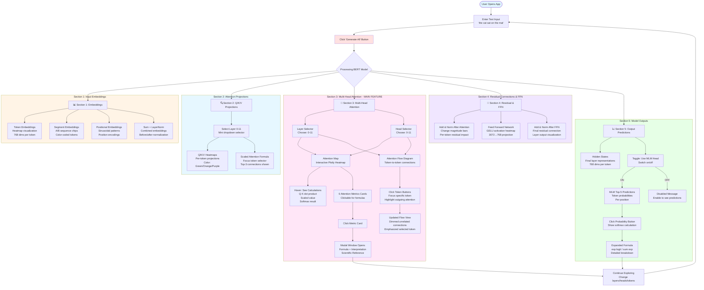
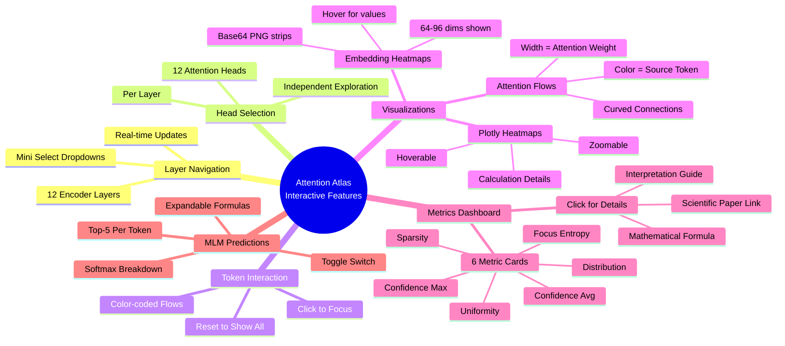
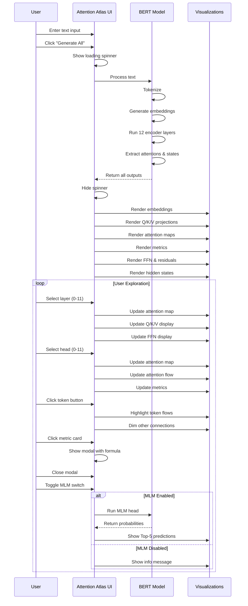
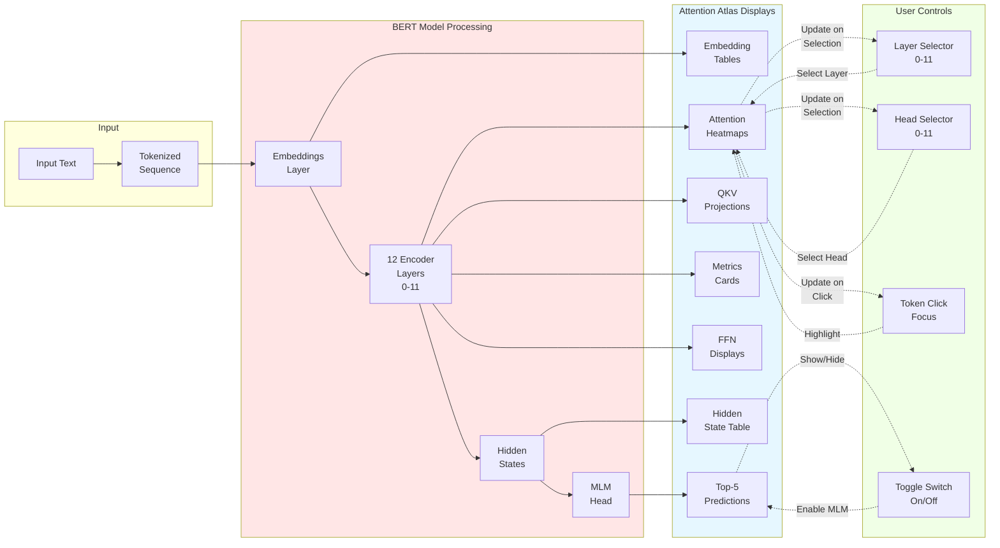

# Attention Atlas - Application Visualization Flow

This diagram shows what the Attention Atlas application visualizes and how users interact with it.

## Application Features & Flow

## Interactive Features Map

## User Interaction Flow

## Data Flow: From Input to Visualization

## Visualization Components

### Section 1: Input Embeddings
- **Token Embeddings**: Heatmap strips showing first 64 dimensions
- **Segment Embeddings**: Color-coded chips (blue/purple) for sentence A/B
- **Positional Embeddings**: Sinusoidal pattern visualization
- **Sum + LayerNorm**: Before/after normalization comparison

### Section 2: Q/K/V Projections
- **Layer Selector**: Mini dropdown (0-11)
- **Three Heatmaps**: Green (Query), Orange (Key), Purple (Value)
- **Scaled Attention**: Formula walkthrough for selected token

### Section 3: Multi-Head Attention (MAIN)
- **Attention Map**: Interactive Plotly heatmap with hover details
  - Shows: Q·K dot product, scaled value, softmax result
  - Click cells to inspect calculations
- **Attention Flow**: Sankey-style token connections
  - Line width = attention weight
  - Click tokens to focus
- **Token Buttons**: Click to highlight specific token's outgoing attention
- **6 Metric Cards**: Click for mathematical formulas and explanations

### Section 4: Residual & FFN
- **Add & Norm**: Bar charts showing magnitude of changes
- **FFN Visualization**: Intermediate (3072) and projection (768) heatmaps
- **Residual Impact**: Per-token change visualization

### Section 5: Outputs
- **Hidden States**: Final layer representations
- **MLM Predictions**: Toggle-able Top-5 token probabilities
- **Expandable Formulas**: Click to see softmax calculations

## Key Features

1. **Real-time Processing**: All calculations done on-demand
2. **12 × 12 = 144 Attention Heads**: Fully explorable
3. **Interactive Plots**: Hover, click, zoom on Plotly visualizations
4. **Educational Modals**: Mathematical formulas with interpretations
5. **Scientific References**: Links to research papers for metrics
6. **Responsive Design**: Dark theme sidebar + light content area
