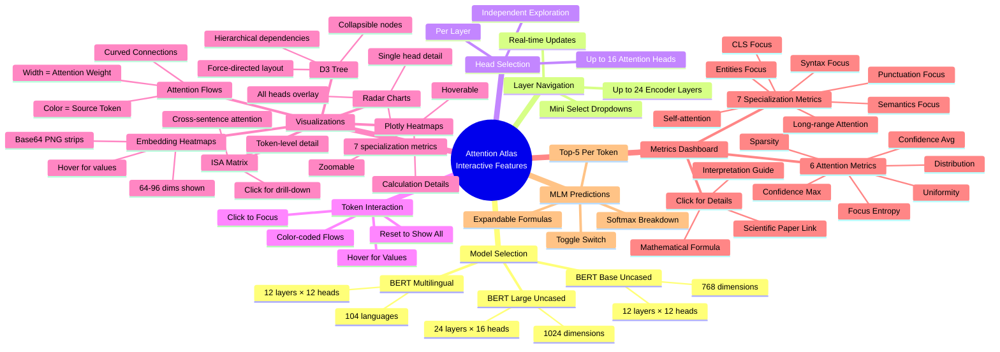
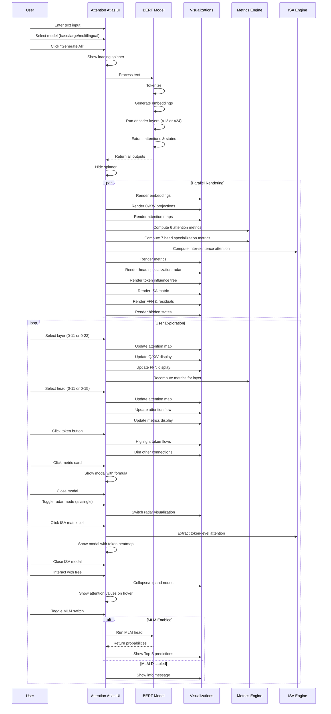
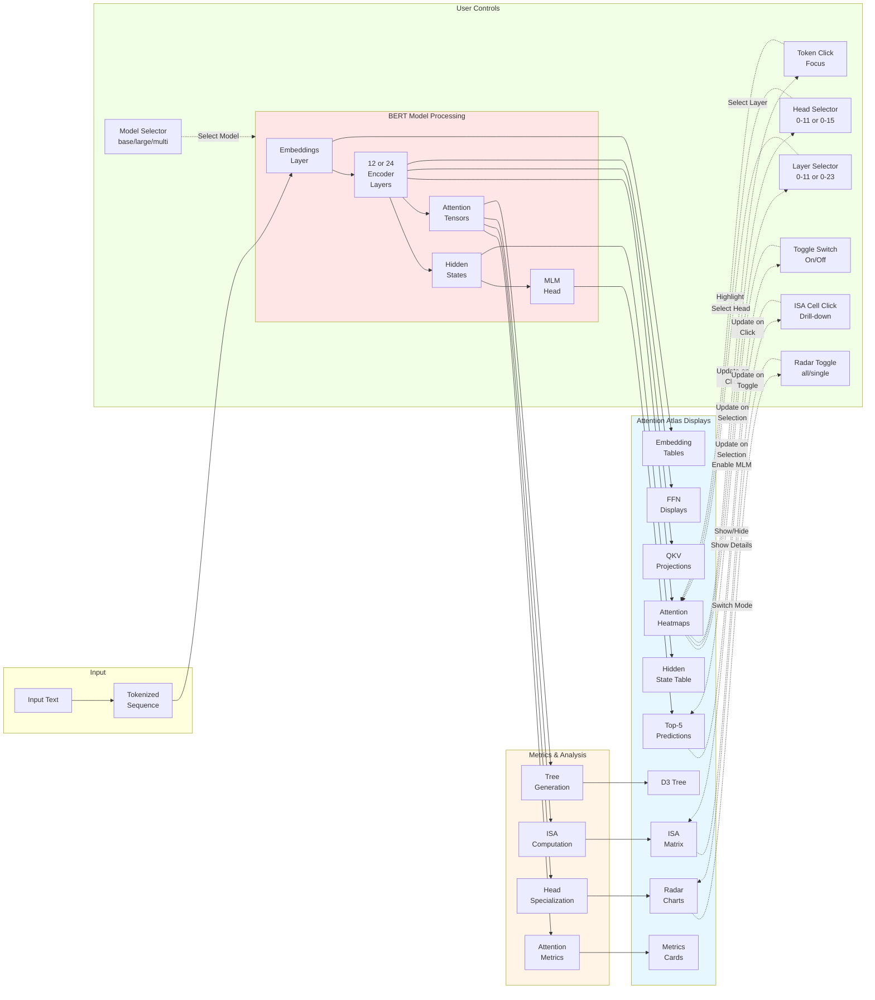

# Attention Atlas - Application Visualization Flow

This document comprehensively explains what the Attention Atlas application visualizes, how users interact with it, and the complete data flow from input to visualization. It serves as a user guide and feature reference for understanding all interactive components and their purposes.

## Application Features & Complete Workflow

```mermaid
flowchart TD
    Start([User Opens App]) --> Input[Enter Text Input<br/>'the cat sat on the mat']

    Input --> Generate[Click 'Generate All' Button]

    Generate --> Processing{Processing BERT Model}

    Processing --> Section1[Section 1: Embeddings]
    Processing --> Section2[Section 2: Q/K/V Projections]
    Processing --> Section3[Section 3: Multi-Head Attention]
    Processing --> Section4[Section 4: Head Specialization]
    Processing --> Section5[Section 5: Token Influence Tree]
    Processing --> Section6[Section 6: Inter-Sentence Attention]
    Processing --> Section7[Section 7: Residual & FFN]
    Processing --> Section8[Section 8: Output Predictions]

    subgraph Embeddings [Section 1: Input Embeddings]
        Section1 --> E1[Token Embeddings<br/>Heatmap visualization<br/>768 dims per token]
        Section1 --> E2[Segment Embeddings<br/>A/B sequence chips<br/>Color-coded tokens]
        Section1 --> E3[Positional Embeddings<br/>Learned patterns<br/>Position encodings]
        Section1 --> E4[Sum + LayerNorm<br/>Combined embeddings<br/>Before/after normalization]
    end

    subgraph QKV [Section 2: Attention Projections]
        Section2 --> Q1[Select Layer 0-11<br/>Mini dropdown selector]
        Q1 --> Q2[Q/K/V Heatmaps<br/>Per-token projections<br/>Color: Green/Orange/Purple]
        Q1 --> Q3[Scaled Attention Formula<br/>Focus token selector<br/>Top-3 connections shown]
    end

    subgraph MultiHead [Section 3: Multi-Head Attention - MAIN FEATURE]
        Section3 --> M1[Layer Selector<br/>Choose: 0-11 or 0-23]
        Section3 --> M2[Head Selector<br/>Choose: 0-11 or 0-15]

        M1 --> M3[Attention Map<br/>Interactive Plotly Heatmap]
        M2 --> M3

        M3 --> M4[Hover: See Calculations<br/>Q·K dot product<br/>Scaled value<br/>Softmax result]

        M1 --> M5[Attention Flow Diagram<br/>Token-to-token connections]
        M2 --> M5

        M5 --> M6[Click Token Buttons<br/>Focus specific token<br/>Highlight outgoing attention]

        M6 --> M7[Updated Flow View<br/>Dimmed unrelated connections<br/>Emphasized selected token]

        M3 --> M8[6 Attention Metrics Cards<br/>Clickable for formulas]

        M8 --> M9[Click Metric Card]
        M9 --> M10[Modal Window Opens<br/>Formula + Interpretation<br/>Scientific Reference]
    end

    subgraph HeadSpec [Section 4: Head Specialization Analysis]
        Section4 --> H1[Mode Toggle<br/>All Heads / Single Head]
        H1 --> H2[Layer Selector<br/>Choose layer to analyze]
        H1 --> H3[Head Selector<br/>For single head mode]
        
        H2 --> H4[Radar Chart Visualization<br/>7 behavioral dimensions]
        H3 --> H4
        
        H4 --> H5[Metric Tags<br/>Click for explanations]
        H5 --> H6[Modal: Metric Details<br/>Formula, interpretation, examples]
    end

    subgraph TokenTree [Section 5: Token Influence Tree]
        Section5 --> T1[D3.js Interactive Tree<br/>Auto-rendered hierarchical view]
        T1 --> T2[Click to Collapse/Expand<br/>Node interactions]
        T1 --> T3[Hover for Details<br/>Attention weights & relationships]
    end

    subgraph ISA [Section 6: Inter-Sentence Attention]
        Section6 --> I1[ISA Matrix Heatmap<br/>Sentence-to-sentence strength]
        I1 --> I2[Click Matrix Cell<br/>Select sentence pair]
        I2 --> I3[Modal Opens<br/>Token-level attention heatmap]
        I3 --> I4[Detailed Cross-Sentence<br/>Token relationships]
    end

    subgraph Residual [Section 7: Residual Connections & FFN]
        Section7 --> R1[Add & Norm After Attention<br/>Change magnitude bars<br/>Per-token residual impact]
        Section7 --> R2[Feed Forward Network<br/>GELU activation heatmap<br/>3072→768 projection]
        Section7 --> R3[Add & Norm After FFN<br/>Final residual connection<br/>Layer output visualization]
    end

    subgraph Output [Section 8: Model Outputs]
        Section8 --> O1[Hidden States<br/>Final layer representations<br/>768 dims per token]
        Section8 --> O2[Toggle: Use MLM Head<br/>Switch on/off]

        O2 -->|ON| O3[MLM Top-5 Predictions<br/>Token probabilities<br/>Per position]
        O2 -->|OFF| O4[Disabled Message<br/>Enable to see predictions]

        O3 --> O5[Click Probability Button<br/>Show softmax calculation]
        O5 --> O6[Expanded Formula<br/>exp logit / sum exp<br/>Detailed breakdown]
    end

    M10 --> Explore[Continue Exploring<br/>Change layers/heads/tokens]
    O6 --> Explore
    H6 --> Explore
    I4 --> Explore
    Explore --> Input

    style Start fill:#e1f5ff
    style Generate fill:#ffe1e1
    style Embeddings fill:#fff4e6
    style QKV fill:#e6f7ff
    style MultiHead fill:#ffe6f7
    style HeadSpec fill:#f0e6ff
    style TokenTree fill:#d4edda
    style ISA fill:#fff3cd
    style Residual fill:#f0e6ff
    style Output fill:#e6ffe6
```



## Interactive Features Map



## User Interaction Flow (Detailed Sequence)



## Data Flow: From Input to Visualization



## Detailed Visualization Components

### Section 1: Input Embeddings

**Purpose**: Visualize the three types of embeddings that BERT combines to create initial token representations.

#### Token Embeddings
- **What**: Learned semantic representations from vocabulary
- **Visualization**: Heatmap strips showing first 64 of 768 dimensions
- **Color Scale**: Intensity represents embedding values
- **Interaction**: Hover to see exact values
- **Insight**: Similar words have similar patterns

#### Segment Embeddings
- **What**: Distinguishes sentence A from sentence B in pairs
- **Visualization**: Color-coded chips (blue for A, red for B)
- **Table**: Shows token → segment mapping
- **Interaction**: Visual color coding per token
- **Insight**: How BERT separates dual inputs

#### Positional Embeddings
- **What**: Learned position information (not sinusoidal in BERT)
- **Visualization**: Heatmap showing positional patterns
- **Display**: First 64 dimensions
- **Interaction**: Hover for values
- **Insight**: Position encoding patterns learned during pre-training

#### Sum + LayerNorm
- **What**: Combined embedding = Token + Segment + Position
- **Visualization**: Before and after layer normalization comparison
- **Display**: Magnitude changes per token
- **Interaction**: Compare raw vs normalized
- **Insight**: Effect of normalization on initial representations

### Section 2: Q/K/V Projections

**Purpose**: Show how input is transformed into Query, Key, Value matrices for attention computation.

#### Layer Selector
- **Control**: Mini dropdown (0-11 for base/multi, 0-23 for large)
- **Effect**: Updates all Q/K/V visualizations
- **Real-time**: Immediate recalculation

#### Three Heatmaps
- **Query (Green)**: What each token is looking for
- **Key (Orange)**: What each token offers
- **Value (Purple)**: Information to be aggregated
- **Display**: First 48 of 64 dimensions per head
- **Hover**: Exact projection values

#### Scaled Attention Formula
- **Feature**: Focus token selector
- **Display**: Top-3 attention connections for selected token
- **Formula**: Shows Q·K^T / √d_k computation step-by-step
- **Educational**: Walkthrough of attention mechanism

### Section 3: Multi-Head Attention (CORE FEATURE)

**Purpose**: Interactive exploration of attention patterns showing which tokens attend to which others.

#### Attention Map
- **Type**: Interactive Plotly heatmap
- **Axes**: Source tokens (rows) × Target tokens (columns)
- **Color**: Attention weight strength (0 to 1)
- **Hover Details**:
  - Q·K dot product (raw score)
  - Scaled value (divided by √d_k)
  - Softmax result (final attention weight)
- **Click**: Inspect specific attention connections
- **Zoom/Pan**: Plotly interactive controls

#### Attention Flow Diagram
- **Type**: Sankey-style flow visualization
- **Connections**: Curved lines between tokens
- **Line Width**: Proportional to attention weight
- **Color**: Source token color coding
- **Threshold**: Only shows weights > 0.05 for clarity
- **Interactive**: Click tokens to focus

#### Token Buttons
- **Purpose**: Focus on specific token's attention
- **Effect**: 
  - Highlights outgoing attention from selected token
  - Dims unrelated connections
  - Emphasizes selected token in flow
- **Reset**: Click "Show All" to reset

#### 6 Metric Cards
- **Display**: Grid of clickable cards
- **Metrics**:
  1. Confidence (Max): Highest attention weight
  2. Confidence (Avg): Average max per query
  3. Focus (Entropy): Attention dispersion (-ΣplogP)
  4. Sparsity: % weights < 0.01
  5. Distribution (Median): 50th percentile
  6. Uniformity: Standard deviation
- **Click**: Opens modal with:
  - Mathematical formula
  - Interpretation guide
  - Use cases
  - Scientific reference

### Section 4: Head Specialization Analysis

**Purpose**: Understand what linguistic and structural patterns each attention head specializes in.

#### Mode Toggle
- **Options**: "All Heads" or "Single Head"
- **All Heads**: Overlay radar for all 12/16 heads in layer
- **Single Head**: Focused view of one head
- **Visual**: Custom radio button toggle

#### Radar Chart
- **Axes**: 7 behavioral dimensions
  1. **Syntax Focus**: Attention to function words (DET, ADP, AUX)
  2. **Semantics Focus**: Attention to content words (NOUN, VERB, ADJ)
  3. **CLS Focus**: Average attention to [CLS] token
  4. **Punctuation Focus**: Attention to punctuation marks
  5. **Entities Focus**: Attention to named entities (NER)
  6. **Long-range**: Attention across 5+ token distances
  7. **Self-attention**: Diagonal attention (tokens to themselves)
- **Scale**: 0 to 1 (min-max normalized across heads)
- **Colors**: Different color per head for comparison
- **Interactive Legend**: Click to toggle head visibility

#### Metric Tags
- **Display**: Clickable badges below radar
- **Click**: Opens modal explaining:
  - Formula and computation method
  - Interpretation of high/low values
  - Examples from literature
  - Linguistic significance

#### POS & NER
- **Backend**: spaCy for tagging
- **Languages**: Auto-detects for multilingual model
- **Alignment**: Maps spaCy word-level tags to BERT subwords

### Section 5: Token Influence Tree

**Purpose**: Hierarchical visualization of attention dependencies showing information flow.

#### D3.js Interactive Tree
- **Layout**: Force-directed tree
- **Root**: Selected focus token (default: first content token)
- **Children**: Top-k tokens with highest attention from parent
- **Depth**: Auto-limited to prevent infinite expansion
- **Edge Thickness**: Represents attention weight
- **Color Coding**: Depth-based coloring

#### Node Interactions
- **Click**: Collapse/expand subtree
- **Hover**: Shows:
  - Token text
  - Attention weight from parent
  - Number of children
- **Drag**: Reposition nodes (D3 physics simulation)

#### Auto-Rendering
- **No Controls**: Automatically generated
- **Max Depth**: Typically 3-4 levels
- **Pruning**: Only shows significant connections (>0.1 weight)

### Section 6: Inter-Sentence Attention (ISA)

**Purpose**: Analyze cross-sentence dependencies to understand discourse coherence and multi-sentence reasoning.

#### ISA Matrix Heatmap
- **What**: Sentence × Sentence attention strength matrix
- **Computation**: max(attention) across all layers, heads, and token pairs
- **Formula**: ISA(Sa, Sb) = max_{l,h,i∈Sa,j∈Sb} A[l,h,i,j]
- **Color**: Gradient showing attention strength
- **Diagonal**: Self-attention within sentences
- **Off-diagonal**: Cross-sentence dependencies

#### Sentence Segmentation
- **Method**: NLTK sentence tokenization
- **Display**: Sentence labels (S1, S2, ...)
- **Text**: Hover to see full sentence text

#### **Click for Drill-Down**
- **Interaction**: Click any matrix cell
- **Effect**: Opens modal showing token-level attention
- **Modal Content**:
  - Token-to-token heatmap for selected sentence pair
  - List of tokens from both sentences
  - Attention values for each token pair
  - Close button to return

#### Token-to-Token Heatmap
- **Axes**: Tokens from sentence A (rows) × Tokens from sentence B (cols)
- **Aggregation**: Max over layers and heads
- **Color**: Attention strength
- **Interpretation**: Shows which specific words connect sentences

#### Use Cases
- **Document Coherence**: Identify sentence relationships
- **Coreference**: Track entity mentions across sentences
- **Discourse Structure**: Understand argument flow
- **Multi-hop Reasoning**: See how information propagates

### Section 7: Residual Connections & Feed-Forward Network

**Purpose**: Visualize the non-attention components of transformer layers.

#### Add & Norm After Attention
- **Display**: Bar chart showing magnitude of changes
- **Computation**: |output - input| per token
- **Interpretation**: How much attention modified each token
- **Insight**: Residual connection importance

#### Feed Forward Network
- **Layers**:
  1. Linear 768→3072 (expansion)
  2. GELU activation
  3. Linear 3072→768 (compression)
- **Visualization**: Heatmap of intermediate activations
- **Display**: First 96 of 3072 dimensions
- **Color**: Activation strength after GELU

#### Add & Norm After FFN
- **Display**: Final residual connection
- **Computation**: Layer output vs FFN input
- **Magnitude**: Per-token change visualization
- **Insight**: Total transformation through layer

### Section 8: Model Outputs

**Purpose**: Display final hidden states and optional token predictions.

#### Hidden States
- **What**: Final layer representations (after 12/24 layers)
- **Display**: Table or heatmap
- **Dimensions**: First 64 of 768/1024 shown
- **Use**: Input to downstream tasks (classification, QA, etc.)

#### MLM Predictions
- **Toggle**: Switch to enable/disable
- **When Enabled**:
  - Runs BertForMaskedLM head
  - Projects to vocabulary (30k or 105k tokens)
  - Applies softmax
  - Shows Top-5 most likely tokens per position
- **When Disabled**: Informational message

### Section 9: Compare Models (Side-by-Side)

**Purpose**: Directly compare the internal representations of two different models (e.g., BERT-base vs BERT-large, or BERT vs GPT-2) for the same input.

#### Dual-Column Layout
- **Model A (Left)**: Primary model, indicated by **Blue** accents and arrows (`.arrow-blue`).
- **Model B (Right)**: Secondary model, indicated by **Pink** accents and arrows (`.arrow-pink`).
- **Synchronization**: Scrolling is synchronized to keep corresponding sections aligned.

#### Comparative Features
- **Visual Differences**: Spot differences in attention patterns, embedding clusters, and projection heatmaps instantly.
- **Metric Comparison**: Compare quantitative attention metrics side-by-side.
- **Head Specialization**: see how two models specialize their heads differently for the same text.
- **ISA**: Compare how different models handle cross-sentence dependencies.

#### Expandable Formulas
- **Feature**: Click on any probability
- **Display**: Softmax calculation breakdown
  ```
  P(token) = exp(logit_token) / Σ exp(logit_i)
  ```
- **Shows**: Raw logit, exp value, sum, final probability
- **Educational**: Understand probability computation

## Key Interactive Features Summary

### Real-time Processing
- All calculations done on-demand when text is submitted
- No pre-computed results
- Authentic model inference

### Comprehensive Coverage
- **144 attention heads** (base/multilingual) or **384 heads** (large)
- **All 12 or 24 layers** fully explorable
- **Every token pair** attention visualized
- **6 quantitative metrics** per head
- **7 specialization metrics** per head

### Interactive Plots
- **Hover**: See detailed calculations
- **Click**: Focus on specific elements
- **Zoom/Pan**: Plotly controls
- **Select**: Choose layers, heads, tokens
- **Toggle**: Switch visualization modes

### Educational Modals
- Mathematical formulas with LaTeX-style formatting
- Interpretation guides
- Example use cases
- Scientific research references

### Multi-Model Support
- Switch between BERT variants
- Automatic adaptation of UI (layer/head counts)
- Consistent visualization across models

### Scientific Grounding
- Metrics from peer-reviewed research
- References to original papers
- Reproducible computations
- Transparent methodology

## Design Philosophy

### Minimalist Aesthetic
- **Color Palette**: Blue, dark blue, light blue, pink
- **Typography**: Clean, modern fonts
- **Layout**: Reduced clutter, focus on visualizations
- **Whitespace**: Generous spacing for readability

### Responsive Design
- **Dark Sidebar**: Fixed position controls
- **Light Content**: Scrollable visualization area
- **Adaptive**: Works on various screen sizes
- **Loading States**: Spinners for async operations

### Accessibility
- Unique IDs for all interactive elements
- Semantic HTML structure
- Keyboard navigation support
- ARIA labels where appropriate

## Technical Implementation

### Frontend
- **Framework**: Shiny for Python
- **Plotting**: Plotly (attention maps, radar, ISA)
- **Tree**: D3.js force-directed layout
- **Styling**: Custom CSS with CSS variables
- **Interaction**: JavaScript event handlers

### Backend
- **Model**: HuggingFace Transformers
- **Inference**: PyTorch
- **NLP**: spaCy (POS, NER), NLTK (sentence splitting)
- **Computation**: NumPy for metrics
- **Caching**: Smart state management for performance

### Data Flow
1. User input → Tokenization
2. BERT forward pass → Extract attentions, states
3. Metric computation → 6 + 7 metrics per head
4. ISA computation → Sentence attention matrix
5. Tree generation → Hierarchical attention structure
6. Rendering → All visualizations simultaneously
7. Interactive updates → Layer/head/token selection

## Conclusion

Attention Atlas provides an unprecedented level of transparency into BERT's attention mechanisms, combining:

- **Quantitative Analysis**: 6 attention metrics + 7 specialization metrics
- **Visual Exploration**: Heatmaps, radar charts, trees, flows
- **Interactive Discovery**: Click, hover, select, toggle
- **Educational Value**: Formulas, interpretations, references
- **Scientific Rigor**: Grounded in research, reproducible results

Whether you're a researcher analyzing attention patterns, a student learning about transformers, or a practitioner debugging model behavior, Attention Atlas offers the tools and visualizations to deeply understand how BERT processes language.
