# Attention Atlas - Application Visualization & User Guide

This document provides a comprehensive guide to the Attention Atlas user interface, interaction workflows, and visualization interpretations. It explains the three-section navigation structure (Overview, Explore Attention, Deep Dive), interactive features, and how to use the application for mechanistic interpretability research.

---

## Table of Contents

- [Application Architecture](#application-architecture)
- [Three-Section Navigation Structure](#three-section-navigation-structure)
- [User Workflow](#user-workflow-from-input-to-insight)
- [Section 1: Overview](#section-1-overview)
- [Section 2: Explore Attention](#section-2-explore-attention)
- [Section 3: Deep Dive](#section-3-deep-dive-advanced-mode)
- [Bias Detection Tab](#section-4-bias-detection-tab-coming-soon)
- [Interactive Features](#interactive-features-summary)
- [Comparison Modes](#comparison-modes)
- [Design Philosophy](#design-philosophy)
- [Technical Implementation](#technical-implementation-details)

---

## Application Architecture

Attention Atlas is organized into **three progressive exploration levels**, each designed to answer different research questions about Transformer behavior:

```mermaid
flowchart TD
    User[User] --> Sidebar[Sidebar Controls]
    Sidebar --> Input[Text Input & Model Selection]
    Input --> Generate[Click 'Generate All']

    Generate --> Pipeline[Heavy Computation Pipeline]

    Pipeline --> Overview[🔍 OVERVIEW SECTION]
    Pipeline --> Explore[🎯 EXPLORE ATTENTION SECTION]
    Pipeline --> DeepDive[⚙️ DEEP DIVE SECTION<br/>Advanced Mode]
    Pipeline --> Bias[🛡️ BIAS DETECTION TAB<br/>Coming Soon]

    Overview --> O1[Global Metrics Dashboard]
    Overview --> O2[MLM Token Predictions]
    Overview --> O3[Radar Metrics Visualization]
    Overview --> O4[Hidden States PCA]

    Explore --> E1[Attention Heatmaps]
    Explore --> E2[Attention Flow Diagrams]
    Explore --> E3[Token Influence Tree]
    Explore --> E4[Inter-Sentence Attention ISA]
    Explore --> E5[Scaled Attention]

    DeepDive --> D1[Token Embeddings + PCA]
    DeepDive --> D2[Positional & Segment Encodings]
    DeepDive --> D3[Q/K/V Projections]
    DeepDive --> D4[Residual Connections]
    DeepDive --> D5[Feed-Forward Network]
    DeepDive --> D6[Head Clustering t-SNE + K-Means]

    Bias --> B1[Token-Level Bias Classification]
    Bias --> B2[Attention-Bias Interaction]
    Bias --> B3[Bias Propagation]

    style Overview fill:#e3f2fd
    style Explore fill:#f3e5f5
    style DeepDive fill:#fff3e0
    style Bias fill:#ffebee
```



---

## Three-Section Navigation Structure

### Design Philosophy

The application follows a **progressive disclosure** pattern:

1. **Overview** (Default): High-level understanding → "What is the model doing?"
2. **Explore Attention** (Interactive): Granular attention analysis → "Which tokens attend to which?"
3. **Deep Dive** (Advanced): Component-level inspection → "How does the architecture process this input?"

### Navigation Methods

- **Floating Control Bar**: Select layer, head, normalization mode
- **Section Tabs/Accordion**: Click to expand Overview, Explore Attention, or Deep Dive
- **View Mode Toggle**: Switch between Basic and Advanced modes
- **Compare Modes**: Enable Model A vs. Model B or Prompt A vs. Prompt B

---

## User Workflow: From Input to Insight


### Step-by-Step Workflow

**1. Input Configuration**
- Enter text in sidebar (e.g., *"The cat sat on the mat."*)
- Select model: BERT-base, BERT-large, BERT-multilingual, GPT-2 (Small, Medium, Large, XL)
- Optional: Enable comparison mode (Model A vs. Model B)

**2. Generate Analysis**
- Click **"Generate All"** button
- Wait for processing (5-15 seconds depending on model size)
- Loading spinner indicates computation in progress

**3. Explore Overview Section**
- Check global metrics (Confidence, Focus, Sparsity, etc.)
- Review MLM predictions (Top-5 tokens per position)
- Examine radar metrics visualization
- Inspect hidden states (Advanced mode)

**4. Interactive Attention Exploration**
- Navigate layers/heads using floating control bar
- Click tokens to focus their attention patterns
- Examine attention heatmaps with hover details
- Explore attention flow diagrams
- Drill down into ISA matrix cells

**5. Deep Architectural Inspection (Advanced Mode)**
- Toggle to Advanced mode
- Inspect token embeddings with PCA visualization
- Examine Q/K/V projections and cosine similarity
- Analyze FFN activations and residual connections
- Review head clustering scatter plot

---

## Section 1: Overview

**Purpose**: High-level model behavior at a glance—global metrics, predictions, and aggregate attention patterns

### Available Visualizations

#### A. Masked Language Model (MLM) Predictions

**What it shows**: Top-5 most likely tokens for each position when masked

**Visualization**:
- Token buttons with probability percentages
- Color-coded confidence levels
- Expandable softmax formula breakdown

**Interaction**:
- Click any probability button → Shows detailed softmax calculation
- Formula: `P(token) = exp(logit) / Σ exp(logits)`
- Displays: Raw logit, exp value, sum, final probability

**Use Cases**:
- Assess model confidence in predictions
- Understand vocabulary preferences
- Evaluate contextual understanding
- Compare predictions across models

**Example**:
```
Input: "The [MASK] sat on the mat"
Top-5: cat (48%), dog (22%), boy (12%), man (10%), bird (8%)
```

---

#### B. Global Attention Metrics Dashboard

**What it shows**: 6 quantitative metrics aggregated across layers/heads

**Metrics Displayed**:

| Metric | Formula | Typical Values | Interpretation |
|--------|---------|----------------|----------------|
| **Confidence (Max)** | `max(A)` | 0.6 - 0.9 | Peak attention strength |
| **Confidence (Avg)** | `mean(max per row)` | 0.4 - 0.7 | Average peak strength |
| **Focus (Entropy)** | `-Σ(A·log(A))` | 1.5 - 3.0 | Attention dispersion |
| **Sparsity** | `% weights < 0.01` | 0.3 - 0.7 | Proportion of weak weights |
| **Distribution (Median)** | `median(A)` | 0.05 - 0.15 | Robust central tendency |
| **Uniformity** | `std(A)` | 0.1 - 0.3 | Weight variability |

**Visualization**:
- Grid of clickable metric cards
- Color-coded values (green = good, yellow = moderate, red = concerning)
- Mini sparkline showing per-layer trends

**Interaction**:
- **Click any card** → Opens modal with:
  - Mathematical formula (LaTeX-style)
  - Interpretation guide (high/low values)
  - Use cases and applications
  - Scientific reference (Golshanrad & Faghih, 2024)
- **Toggle**: Per-layer view vs. All-layers aggregate

**Use Cases**:
- Quantify attention behavior scientifically
- Compare heads/layers/models numerically
- Identify anomalous attention patterns
- Track attention evolution across layers

---

#### C. Radar Metrics Visualization

**What it shows**: Multi-dimensional radar/spider chart of attention metrics

**Visualization**:
- Circular plot with 6 axes (one per metric)
- Overlay multiple layers or heads
- Min-max normalized for fair comparison

**Interaction**:
- Hover: See exact metric values
- Legend: Click to toggle layer/head visibility
- Mode: All-layers overlay or single-layer focus

**Use Cases**:
- Visual pattern recognition across heads
- Identify distinct behavioral profiles
- Compare attention dynamics between layers

---

#### D. Hidden States Visualization (Advanced Mode)

**What it shows**: Final layer embeddings (768-dim or 1024-dim)

**Visualization**:
- Heatmap: First 64 dimensions per token
- PCA scatter plot: 2D projection of embedding space
- Token labels with color coding

**Interaction**:
- Hover: See dimension values
- Zoom/Pan: Plotly controls
- Select tokens: Highlight in both views

**Use Cases**:
- Downstream task analysis
- Representation quality assessment
- Token similarity in latent space
- Contextualized embedding inspection

---

## Section 2: Explore Attention

**Purpose**: Interactive, granular analysis of attention mechanisms and token-to-token relationships

### Available Visualizations

#### A. Multi-Head Attention Heatmaps

**What it shows**: Source tokens (rows) × Target tokens (columns) attention matrix

**Visualization**:
- Interactive Plotly heatmap
- Color gradient: White (low) → Blue (high) attention
- Grid lines for token boundaries
- Annotations with attention values

**Interaction**:
- **Hover**: Reveals detailed calculation breakdown
  - Q·K dot product (raw score)
  - Scaled value (divided by √d_k = √64 = 8)
  - Softmax result (final attention weight)
- **Click**: Focus on specific token pair
- **Zoom/Pan**: Plotly interactive controls
- **Layer/Head selection**: Floating control bar

**Use Cases**:
- Identify which tokens attend to which
- Spot syntactic vs. semantic attention patterns
- Compare attention across layers/heads
- Debug model behavior on specific inputs

**Example Patterns**:
- **Early layers**: Local attention (neighboring tokens)
- **Middle layers**: Syntactic dependencies (e.g., "cat" → "the")
- **Late layers**: Semantic relationships (e.g., "cat" → "mat")

---

#### B. Attention Flow Diagrams

**What it shows**: Sankey-style token-to-token connection flows

**Visualization**:
- Curved lines between tokens
- Line width ∝ attention weight
- Color: Source token color coding
- Threshold: Only shows weights > 0.05

**Interaction**:
- **Click token button**: Focus on that token's outgoing attention
  - Highlights relevant connections
  - Dims unrelated flows
  - Shows attention weight labels
- **Reset**: Click "Show All" to restore full view
- **Hover**: Displays exact attention weight

**Use Cases**:
- Visual information flow analysis
- Identify primary vs. secondary attention targets
- Understand token influence propagation
- Present attention patterns intuitively

---

#### C. Token Influence Tree

**What it shows**: Hierarchical multi-hop attention dependencies

**Visualization**:
- D3.js force-directed tree layout
- Root: Selected focus token (default: first content token)
- Children: Top-k tokens with highest attention from parent
- Edge thickness: Attention weight strength
- Color: Depth-based coloring (root = blue, depth 1 = green, depth 2 = yellow)

**Interaction**:
- **Click node**: Collapse/expand subtree
- **Hover node**: Shows:
  - Token text
  - Attention weight from parent
  - Q·K similarity score
  - Number of children
- **Drag**: Reposition nodes (physics simulation)
- **Auto-depth limiting**: Max 3-4 levels to prevent clutter

**Use Cases**:
- Compositional structure analysis
- Multi-hop reasoning visualization
- Dependency chain exploration
- Attention recursion detection

**Example**:
```
Tree for "sat" in "The cat sat on the mat":
sat
├── cat (0.42)
│   └── the (0.35)
├── on (0.28)
│   └── mat (0.31)
└── [CLS] (0.15)
```

---

#### D. Inter-Sentence Attention (ISA)

**What it shows**: Cross-sentence dependency analysis for multi-sentence inputs

**Visualization**:
- **ISA Matrix**: Sentence × Sentence heatmap
- **Color**: Attention strength (white = weak, red = strong)
- **Diagonal**: Self-attention within sentences
- **Off-diagonal**: Cross-sentence dependencies

**Formula**:
```
ISA(Sa, Sb) = max_{layers, heads, i∈Sa, j∈Sb} A[l, h, i, j]
```

**Interaction**:
- **Hover cell**: Shows sentence texts
- **Click cell**: Opens modal with token-level drill-down
  - Token-to-token heatmap for selected sentence pair
  - List of tokens from both sentences
  - Attention values for each token pair
  - Max layer/head information
- **Close modal**: Return to ISA matrix

**Use Cases**:
- Document coherence analysis
- Coreference resolution tracking
- Discourse structure understanding
- Multi-sentence reasoning tasks

**Example**:
```
Input: "The cat sat on the mat. It was sleeping."
ISA Matrix:
       S1    S2
S1   [0.88] [0.62]   ← "cat" → "It" coreference
S2   [0.51] [0.85]
```

---

#### E. Scaled Attention Visualization (Advanced Mode)

**What it shows**: Step-by-step attention computation with different normalization modes

**Visualization**:
- Side-by-side heatmaps showing:
  - Raw scores (Q·K^T)
  - Scaled scores (Q·K^T / √d_k)
  - Softmax output (final attention)

**Interaction**:
- **Normalization selector**: Raw / Layer-norm / Softmax
- **Focus token selector**: Choose query token
- **Formula display**: Shows computation steps
  ```
  1. Q·K^T = [3.2, 1.8, 0.5, ...]
  2. Scaled = [0.4, 0.225, 0.0625, ...]
  3. Softmax = [0.42, 0.28, 0.15, ...]
  ```

**Use Cases**:
- Educational tool for understanding attention mechanism
- Debug numerical issues (vanishing/exploding attention)
- Understand scaling factor impact
- Validate attention computation

---

## Section 3: Deep Dive (Advanced Mode)

**Purpose**: Component-level inspection of the complete Transformer processing pipeline

**Activation**: Toggle "Advanced Mode" in sidebar

### Available Visualizations

#### A. Token Embeddings

**What it shows**: Context-independent word representations from vocabulary

**Visualization**:
- **Heatmap**: First 64 of 768 dimensions per token
- **PCA Scatter**: 2D projection of embedding space
- **Similarity Table**: Top-K most similar tokens via cosine similarity

**Dimensions**: 768 (BERT-base) or 1,024 (BERT-large) per token

**Interaction**:
- **Hover heatmap**: See dimension values
- **Click token in PCA**: Highlight in heatmap
- **Similarity table**: Click token → Navigate to that token's embeddings

**Use Cases**:
- Vocabulary structure analysis
- Word similarity inspection
- Embedding quality assessment
- Subword tokenization understanding

**Mathematical Representation**:
```
E_token[i] = Embedding_table[token_id[i]]
where Embedding_table ∈ ℝ^(vocab_size × hidden_size)
```

---

#### B. Segment Embeddings (BERT Only)

**What it shows**: Binary encoding distinguishing Sentence A from Sentence B

**Visualization**:
- Color-coded token chips (Blue = Sentence A, Red = Sentence B)
- Table: Token → Segment ID mapping
- Heatmap: 768-dim segment embedding vectors

**Use Cases**:
- Question-answering task analysis
- Natural language inference inspection
- Sentence pair task understanding

**Example**:
```
Input: "What is the cat? [SEP] The cat is an animal."
Segment: [A A A A A A     B B B B B B B B]
IDs:     [0 0 0 0 0 0     1 1 1 1 1 1 1 1]
```

---

#### C. Positional Embeddings

**What it shows**: Position encoding patterns

**BERT**: Learned position embeddings (768-dim vectors for positions 0-511)
**GPT-2**: Sinusoidal position encodings

**Visualization**:
- Heatmap: Position × Dimension
- Pattern recognition: Periodic structures in sinusoidal (GPT-2)

**Use Cases**:
- Position sensitivity analysis
- Sequence length impact understanding
- Attention bias due to position

---

#### D. Sum & Layer Normalization

**What it shows**: Combined embeddings before entering Transformer blocks

**Formula**:
```
E_combined = TokenEmb + PositionalEmb + SegmentEmb  (BERT)
E_normalized = LayerNorm(E_combined)
```

**Visualization**:
- **Before LayerNorm**: Raw combined embeddings
- **After LayerNorm**: Normalized values (mean=0, std=1)
- **Bar chart**: Magnitude changes per token

**Use Cases**:
- Understand normalization impact
- Identify embedding scale issues
- Debug initialization problems

---

#### E. Query/Key/Value (Q/K/V) Projections

**What it shows**: Linear projections for multi-head attention

**Visualization**:
- **Three heatmaps**: Q (green), K (orange), V (purple)
- **Dimensions displayed**: First 48 of 64 per head
- **Cosine similarity matrix**: Q·K compatibility scores
- **Top-K table**: Most relevant keys per query
- **Combined PCA**: Q/K/V in shared 2D space

**Formula**:
```
Q_i = X · W^Q_i  where W^Q_i ∈ ℝ^(768×64)
K_i = X · W^K_i  where W^K_i ∈ ℝ^(768×64)
V_i = X · W^V_i  where W^V_i ∈ ℝ^(768×64)
```

**Interaction**:
- **Layer/Head selector**: Choose which projection to display
- **Hover**: See exact projection values
- **Cosine similarity**: Click to see formula
  ```
  sim(Q_i, K_j) = (Q_i · K_j) / (|Q_i| · |K_j|)
  ```

**Use Cases**:
- Understand attention compatibility computation
- Identify which queries match which keys
- Analyze projection quality
- Debug attention anomalies

---

#### F. Residual Connections & Add + Norm

**What it shows**: Residual skip connections and layer normalization

**Two locations**:
1. **Post-Attention**: `output = LayerNorm(input + MultiHeadAttention(input))`
2. **Post-FFN**: `output = LayerNorm(intermediate + FFN(intermediate))`

**Visualization**:
- **Bar chart**: Δ magnitude per token (`|output - input|`)
- **Color**: Change intensity (blue = small, red = large)
- **Table**: Before/after values

**Use Cases**:
- Assess how much each sub-layer modifies tokens
- Identify layers with large transformations
- Understand gradient flow in deep networks
- Debug exploding/vanishing gradients

---

#### G. Feed-Forward Network (FFN)

**What it shows**: Non-linear transformation in each encoder layer

**Architecture**:
```
FFN(x) = W₂ · GELU(W₁ · x + b₁) + b₂
768 → 3,072 → 768 (4× expansion)
```

**Visualization**:
- **Heatmap**: Intermediate activations (first 96 of 3,072 dimensions)
- **Color**: Activation intensity after GELU
- **Histogram**: Distribution of activation values

**Use Cases**:
- Understand non-linear transformations
- Identify dead/saturated neurons
- Analyze task-specific feature learning
- Compare FFN behavior across layers

---

#### H. Head Clustering & Specialization

**What it shows**: Automatic grouping of attention heads into behavioral clusters

**Algorithm**:
1. Compute 7 specialization metrics per head (Syntax, Semantics, CLS, Punct, Entities, LongRange, Self)
2. Apply t-SNE: 7D → 2D projection
3. Run K-Means: Cluster heads (optimal K via Silhouette Score)
4. Semantic naming: e.g., "Syntactic Specialists", "Long-Range Heads"

**Visualization**:
- **2D scatter plot**: Heads colored by cluster
- **Cluster labels**: Descriptive names
- **Silhouette score**: Clustering quality metric

**Interaction**:
- **Hover point**: Shows head ID, layer, cluster, metrics
- **Click cluster**: Filter to show only that cluster's heads
- **Legend**: Toggle cluster visibility

**Use Cases**:
- Architectural interpretation
- Head redundancy analysis
- Pruning candidate identification
- Behavioral pattern discovery

**Example**:
```
Cluster 1 (Blue): "Syntactic Specialists"
  - High Syntax Focus (0.8)
  - Low Semantics Focus (0.2)
  - Heads: L2H3, L3H1, L5H7

Cluster 2 (Red): "Long-Range Heads"
  - High Long-Range (0.75)
  - Low Self-Attention (0.15)
  - Heads: L9H4, L10H2, L11H8
```

---

## Section 4: Bias Detection Tab (Coming Soon)

**Purpose**: Ethical AI analysis—detect, quantify, and understand how attention mechanisms process biased content

### Planned Features

#### A. Token-Level Bias Classification

**Categories**:
- **Generalization (GEN)**: Overgeneralizations (e.g., "all lawyers are rich")
- **Unfairness (UNFAIR)**: Discriminatory language (e.g., "women can't code")
- **Stereotypes (STEREO)**: Cultural/social stereotypes (e.g., "Asians are good at math")

**Visualization**:
- Heatmap: Tokens colored by bias type
- Table: Token → Bias category → Confidence score
- Spans: Highlighted biased phrases

---

#### B. Attention-Bias Interaction Analysis

**What it shows**: Which attention heads focus on biased tokens

**Formula**:
```
AttentionToBias(head_h) = Σ_{i∈BiasTokens} mean_j(A_h[j, i])
```

**Visualization**:
- Head × Bias Type matrix heatmap
- Identifies heads that amplify vs. mitigate bias

---

#### C. Bias Propagation Across Layers

**What it shows**: How bias signals evolve through encoder stack

**Visualization**:
- Line plot: Bias intensity vs. Layer
- Tracks amplification (increasing) vs. mitigation (decreasing)

**Use Cases**:
- Ethical AI auditing
- Bias mitigation strategy development
- Model fairness assessment

---

## Interactive Features Summary

### Real-Time Processing
- All calculations on-demand (no pre-computed results)
- Authentic model inference via PyTorch
- 5-15 second processing depending on model size

### Comprehensive Coverage
- **144-384 attention heads**: Full coverage of all models
- **All 12 or 24 layers**: Completely explorable
- **Every token pair**: Complete attention matrix
- **13 quantitative metrics**: 6 attention + 7 specialization

### Interactive Controls

| Control | Location | Effect |
|---------|----------|--------|
| **Layer Selector** | Floating control bar | Changes layer for all visualizations |
| **Head Selector** | Floating control bar | Changes head for attention heatmap/flow |
| **Token Click** | Attention flow | Focuses on token's outgoing attention |
| **Metric Card Click** | Overview section | Opens formula modal |
| **ISA Cell Click** | ISA matrix | Opens token-level drill-down modal |
| **Tree Node Click** | Token influence tree | Collapses/expands subtree |
| **View Mode Toggle** | Sidebar | Switches Basic ↔ Advanced |
| **Normalization Selector** | Floating control bar | Changes attention normalization |
| **Top-K Selector** | Floating control bar | Adjusts number of connections shown |

### Educational Modals

When you click on metric cards, you see:
- **Mathematical formula**: LaTeX-style with proper notation
- **Interpretation guide**: What high/low values mean
- **Use cases**: Research applications
- **Scientific reference**: Original paper citation

**Example (Confidence Max)**:
```
Formula: C_max = max_{i,j}(A_ij)

Interpretation:
- High values (> 0.8): Strong, decisive attention focus
- Low values (< 0.3): Distributed, uncertain attention

Use Cases:
- Quantify attention sharpness
- Compare heads/layers/models
- Identify confident vs. uncertain predictions

Reference:
Golshanrad & Faghih (2024), "From Attention to Assurance"
DOI: 10.2139/ssrn.4856933
```

---

## Comparison Modes

### Mode 1: Compare Models (Model A vs. Model B)

**Purpose**: Side-by-side architectural behavior analysis

**Activation**: Enable "Compare Models" in sidebar

**Layout**:
- Dual-column layout
- Model A (Blue) on left
- Model B (Pink) on right
- Synchronized scrolling

**Features**:
- Independent model selection per column
- Shared layer/head controls (optional)
- Visual differences highlighted
- Metric comparison tables

**Use Cases**:
- BERT-base vs. BERT-large comparison
- BERT vs. GPT-2 architectural differences
- English vs. Multilingual model behavior
- Fine-tuned vs. Pre-trained comparison

---

### Mode 2: Compare Prompts (Prompt A vs. Prompt B)

**Purpose**: Analyze model consistency across different inputs

**Activation**: Enable "Compare Prompts" in sidebar

**Layout**:
- Tab interface for switching between prompts
- Same model, different inputs
- Overlay visualizations for direct comparison

**Use Cases**:
- Input perturbation analysis
- Model robustness testing
- Attention consistency evaluation
- Adversarial input detection

---

## Design Philosophy

### Minimalist Aesthetic

**Color Palette**:
- Primary: Blue (#2196F3), Dark Blue (#1565C0)
- Secondary: Pink (#E91E63) for Model B
- Neutral: Gray (#757575), Light Gray (#EEEEEE)
- Accent: Green (success), Red (error), Yellow (warning)

**Typography**:
- Headers: Inter, -apple-system, sans-serif
- Body: System fonts for performance
- Code: Fira Code, monospace

**Layout**:
- Dark sidebar (left, fixed position)
- Light content area (right, scrollable)
- Generous whitespace for readability
- Card-based component organization

---

### Responsive Design

**Breakpoints**:
- Desktop: ≥1200px (full two-column layout)
- Tablet: 768px-1199px (stacked layout)
- Mobile: <768px (single column, simplified)

**Adaptive Elements**:
- Sidebar collapses to hamburger menu on mobile
- Heatmaps resize to fit viewport
- Tables become scrollable horizontally
- Modals overlay fullscreen on small screens

---

### Accessibility

**Features**:
- Semantic HTML structure
- ARIA labels for interactive elements
- Keyboard navigation support (Tab, Enter, Esc)
- Focus indicators on all controls
- High contrast text (WCAG AA compliant)
- Alt text for all visualizations

---

## Technical Implementation Details

### Frontend Stack

**Framework**: Shiny for Python
- Reactive programming model
- Automatic UI updates on state changes
- Server-side rendering for security

**Plotting Libraries**:
- **Plotly**: Attention heatmaps, radar charts, ISA matrices
  - Interactive hover/zoom/pan
  - High-performance WebGL rendering
- **D3.js**: Token Influence Tree
  - Force-directed layout simulation
  - Collapsible nodes with transitions

**Styling**:
- Custom CSS with CSS variables for theming
- Flexbox & Grid for responsive layouts
- Smooth transitions and animations

---

### Backend Stack

**Model Loading**: `ModelManager` singleton
- Lazy loading (only loads when first used)
- Caching in memory for fast switching
- Device management (CUDA/CPU auto-detection)

**Computation Pipeline** (`heavy_compute` function):
1. Tokenization (WordPiece for BERT, BPE for GPT-2)
2. Model inference (forward pass, no gradients)
3. Extraction: Attentions, hidden states, embeddings
4. Metrics computation: 6 attention + 7 specialization
5. ISA computation: Sentence segmentation + aggregation
6. Tree generation: Multi-hop attention traversal
7. Head clustering: t-SNE + K-Means + semantic naming

**State Management**:
- `cached_result`: Model A outputs
- `cached_result_B`: Model B outputs (comparison mode)
- `global_layer`, `global_head`, `global_topk`: Shared controls
- `view_mode`: Basic or Advanced
- `compare_mode`: Single or dual model

---

### Performance Optimizations

**Caching Strategy**:
- Results cached until text/model changes
- Visualizations cached until layer/head changes
- PCA projections computed once per input

**Lazy Rendering**:
- Deep Dive components only rendered in Advanced mode
- ISA drill-down modals rendered on-demand
- Tree visualization deferred until section expanded

**Data Reduction**:
- Heatmaps show subset of dimensions (64 of 768)
- FFN displays first 96 of 3,072 intermediate dims
- Attention flow thresholded (>0.05) to reduce clutter

---

## Conclusion

Attention Atlas provides a comprehensive, user-friendly interface for exploring Transformer attention mechanisms across **three progressive levels**:

1. **Overview**: High-level metrics and predictions
2. **Explore Attention**: Interactive attention analysis
3. **Deep Dive**: Component-level architectural inspection

Whether you're:
- **Researching** mechanistic interpretability
- **Teaching** Transformer architecture
- **Debugging** model behavior
- **Auditing** for bias and fairness

...Attention Atlas offers the tools and visualizations to deeply understand how BERT and GPT-2 process language, from raw text input to final predictions.

---

**Navigation Summary**:

| Section | Key Visualizations | Primary Use |
|---------|-------------------|-------------|
| **Overview** | Metrics, MLM, Radar, Hidden States | Model behavior at a glance |
| **Explore Attention** | Heatmaps, Flows, Tree, ISA | Token-to-token relationships |
| **Deep Dive** | Embeddings, Q/K/V, FFN, Clustering | Architectural component analysis |
| **Bias Detection** | Token bias, Attention-bias, Propagation | Ethical AI auditing |

Start with **Overview** to understand what the model is doing, move to **Explore Attention** to see how it's doing it, and dive into **Deep Dive** to inspect why it works the way it does.

---

## Planned Features (Thesis Validation Phase)

The following features are **planned for implementation** as part of the Master's thesis validation:

### 1. Faithfulness Validation Panel

**Location**: New tab "Faithfulness Analysis"

**What it will show**: Side-by-side comparison of attention weights vs. gradient-based attributions

**Components**:
- **Dual Heatmaps**: Attention (left) vs. Integrated Gradients (right)
- **Correlation Score**: Spearman-r coefficient with color-coded interpretation
  - Green (r > 0.5): Strong correlation → attention is faithful
  - Yellow (0.3 < r < 0.5): Moderate correlation
  - Red (r < 0.3): Weak correlation → attention may be misleading
- **Toggle Options**: Switch between IG, LRP, Gradient×Input baselines
- **Token Highlighting**: Click token to see its attribution from both methods

**Research Value**: Quantifies when attention is/isn't a reliable interpretability signal

---

### 2. Correlation Dashboard

**Location**: New tab "Correlation Analysis"

**What it will show**: Three-way relationships between attention, performance, and fairness

**Three Panels**:

#### Panel A: Attention ↔ Performance
- **Scatter Plot**: Each point = one attention head
- **X-axis**: Attention metric (Confidence, Focus, Sparsity, etc.)
- **Y-axis**: Head contribution to task accuracy (via ablation)
- **Color**: Layer (early layers = blue, late layers = red)
- **Interaction**: Click point to jump to that head's visualizations

#### Panel B: Attention ↔ Fairness
- **Scatter Plot**: Each point = one attention head
- **X-axis**: Attention to bias tokens (proportion)
- **Y-axis**: StereoSet bias score (SS)
- **Color**: Head cluster (Syntactic, Semantic, etc.)
- **Finding**: Identify "bias-amplifying" heads (high SS)

#### Panel C: Performance ↔ Fairness Trade-off
- **Scatter Plot**: Each point = one attention head
- **X-axis**: Task accuracy
- **Y-axis**: Fairness (1 - bias_score)
- **Pareto Frontier**: Line connecting optimal heads (high accuracy, high fairness)
- **Use Case**: Inform model pruning decisions (remove bias-amplifying heads)

**Correlation Matrix Heatmap**:
- Rows/Columns: All metrics (6 attention + performance + fairness)
- Cell color: Pearson correlation coefficient
- **Example Finding**: "Focus (Entropy) negatively correlates with bias (r = -0.45)"

---

### 3. Benchmark Integration

**Location**: Sidebar dropdown "Dataset Selector"

**Supported Benchmarks**:
- **GLUE**: CoLA, SST-2, MRPC, QQP, MNLI, QNLI, RTE, WNLI
- **SuperGLUE**: BoolQ, CB, COPA, MultiRC, ReCoRD, WiC
- **StereoSet**: Intra-sentence, Inter-sentence bias examples

**Workflow**:
1. User selects dataset + task (e.g., "GLUE → MNLI")
2. System loads examples from dataset
3. Dropdown shows example selector (e.g., "Example 1/9815")
4. Click "Generate" to analyze that example
5. Batch processing option: "Analyze all 100 examples" → CSV export with metrics

**Aggregated Statistics**:
- Average attention metrics per task
- Head importance ranking per task
- Cross-task comparison (e.g., "Which heads are important for both SST-2 and MNLI?")

---

### 4. StereoSet Analysis Panel

**Location**: Enhanced "Bias Detection" tab

**New Components**:

#### StereoSet Score Card
- **LMS (Language Modeling Score)**: Model quality (0-100%)
- **SS (Stereotype Score)**: Bias preference (ideal = 50%)
- **ICAT**: Balanced metric (higher = better)
- **Breakdown by bias type**: Gender, race, profession, religion

#### Attention-to-Bias Heatmap
- **Head × Bias Type Matrix**: Shows which heads attend to which bias categories
- **Example**: "Layer 9, Head 4 strongly attends to gender-biased tokens (0.78)"

#### Bias Propagation Plot
- **Line Graph**: Bias intensity vs. Layer
- **Finding**: "Bias amplifies from layer 6 onwards"

---

### 5. User Study Interface

**Location**: Hidden by default, activated via URL parameter `?study_mode=true`

**Components**:

#### Task Overlay
- **Task Instructions**: Clear description of current task
- **Timer**: Countdown for task completion time measurement
- **Submit Button**: Records answer and moves to next task

#### Interaction Logger
- Logs every click, hover, scroll
- Tracks time spent on each visualization
- Navigation path analysis (which features are used most?)

#### Post-Task Questionnaire
- System Usability Scale (SUS) - 10 questions, 5-point Likert scale
- NASA-TLX Cognitive Load - 6 dimensions
- Open-ended feedback: "What was most helpful?" "What was confusing?"

**Data Export**: CSV with columns: `participant_id, task_id, completion_time, accuracy, clicks, sus_score, feedback`

---

## Implementation Priority

| Feature | Priority | Estimated Effort | Target Completion |
|---------|----------|------------------|-------------------|
| **Faithfulness Validation** | 🔴 Critical | 3-4 weeks | Week 12 |
| **Correlation Dashboard** | 🔴 Critical | 2 weeks | Week 13 |
| **StereoSet Integration** | 🔴 High | 1-2 weeks | Week 14 |
| **GLUE Integration** | 🟡 Medium | 1 week | Week 14 |
| **User Study Interface** | 🟡 Medium | 0.5 weeks | Week 15 |

**Detailed Timeline**: See [ROADMAP.md](../ROADMAP.md) for complete implementation plan.

---

**Attention Atlas** — Making Transformer attention mechanisms interpretable, one head at a time.

**Academic Context**: This user guide documents the current implementation and planned extensions for a Master's thesis on **Interpretable Large Language Models through Attention Mechanism Visualization**. For full thesis objectives and validation strategy, see [README.md](../README.md).
