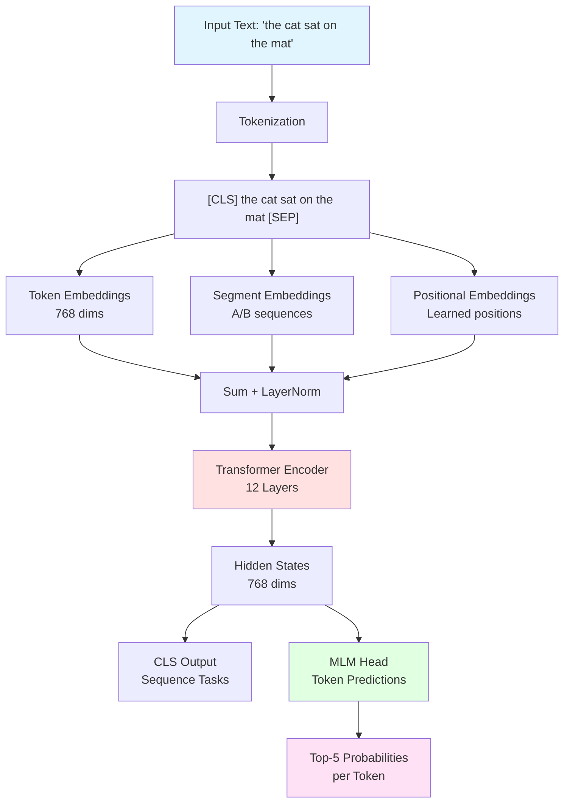
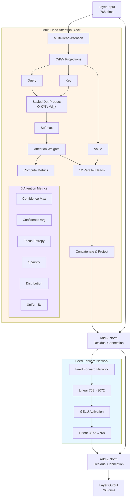
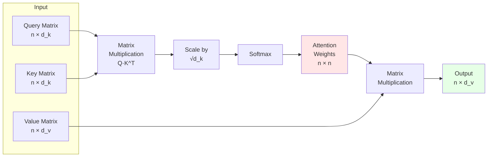
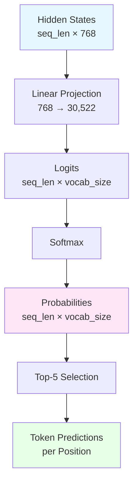

# BERT Architecture Pipeline

This document illustrates the complete BERT processing pipeline as visualized in Attention Atlas.

## Main Pipeline

## Transformer Encoder Layer (×12)

## Attention Mechanism Detail

## MLM Head Processing

## Component Details

### 1. Input Processing
- **Tokenization**: Text → Token IDs using BERT WordPiece tokenizer
- **Special Tokens**: `[CLS]` at start, `[SEP]` at end
- **Maximum Length**: 512 tokens

### 2. Embedding Layer
Three types of embeddings are summed:
- **Token Embeddings**: Learned representations (30,522 vocab → 768 dims)
- **Positional Embeddings**: Learned position information (0-511 → 768 dims)
- **Segment Embeddings**: Sentence A/B distinction (2 → 768 dims)

### 3. Transformer Encoder (12 Layers)

#### Multi-Head Attention
- **Heads**: 12 parallel attention mechanisms per layer
- **Head Dimension**: 64 (768 / 12)
- **Process**:
  1. Project input to Q, K, V matrices
  2. Compute attention: `Attention(Q,K,V) = softmax(QK^T/√d_k)V`
  3. Concatenate heads and project back

#### Attention Metrics (calculated per head)
- **Confidence (Max)**: `max(attention_matrix)`
- **Confidence (Avg)**: `mean(max_per_row)`
- **Focus (Entropy)**: `-Σ(p·log(p))`
- **Sparsity**: `% weights < 0.01`
- **Distribution**: `median(attention_weights)`
- **Uniformity**: `std(attention_weights)`

#### Feed Forward Network
- **Expansion**: 768 → 3,072 dimensions
- **Activation**: GELU (Gaussian Error Linear Unit)
- **Compression**: 3,072 → 768 dimensions

#### Residual Connections
- Applied after attention: `output = LayerNorm(input + attention(input))`
- Applied after FFN: `output = LayerNorm(input + FFN(input))`

### 4. Output Layer

#### MLM (Masked Language Modeling) Head
- **Linear**: 768 → 30,522 (vocab size)
- **Softmax**: Convert logits to probabilities
- **Top-5**: Display most likely tokens per position

## Visualization Features

### Interactive Elements
1. **Layer Selection**: Navigate through 12 encoder layers
2. **Head Selection**: Explore individual attention heads (12 per layer)
3. **Token Focus**: Click tokens to highlight attention patterns
4. **Attention Flow**: Visualize token-to-token connections
5. **Heatmaps**: Color-coded attention weights

### Data Displayed
- Token embeddings (first 64 dims visualized)
- Positional encodings (sinusoidal patterns)
- Q/K/V projections (first 48 dims per token)
- Attention matrices (all token pairs)
- FFN intermediate activations (first 96 dims)
- Hidden states evolution across layers
- Token prediction probabilities

## Technical Specifications

- **Model**: `bert-base-uncased`
- **Parameters**: ~110M
- **Layers**: 12
- **Hidden Size**: 768
- **Attention Heads**: 12
- **Intermediate Size**: 3,072
- **Vocabulary**: 30,522 WordPiece tokens
- **Max Sequence Length**: 512

## References

All visualizations and metrics are computed in real-time from the actual BERT model using:
- `transformers` library (HuggingFace)
- `torch` for model inference
- `plotly` for interactive visualizations
