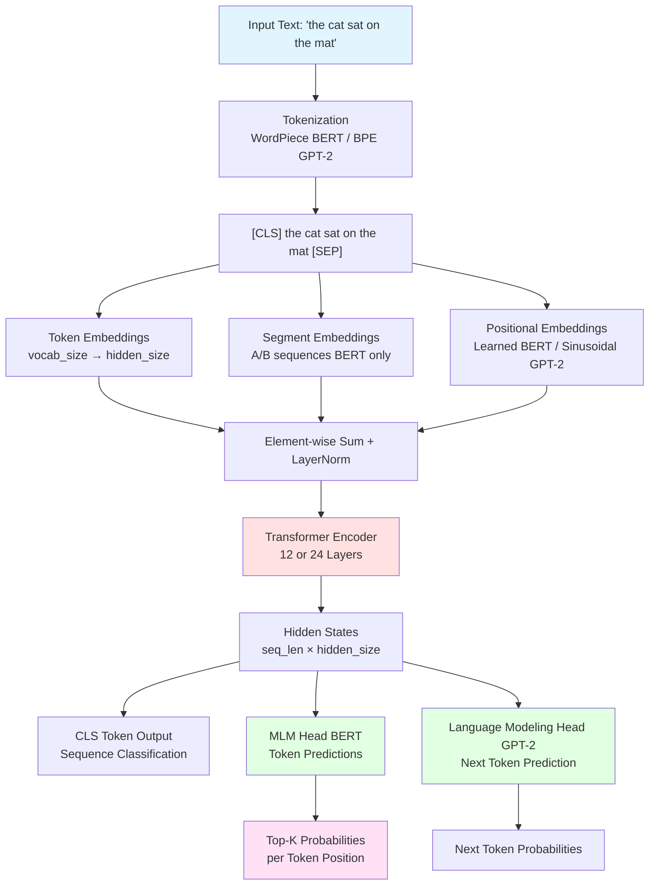
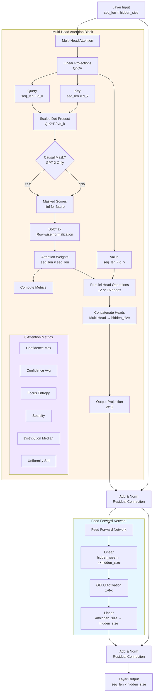
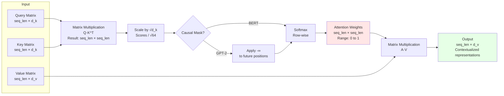
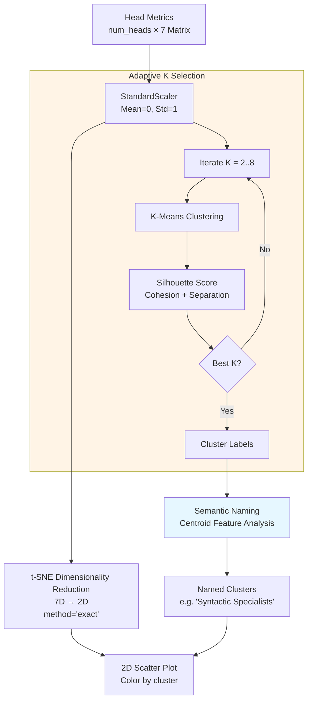

# BERT & GPT-2 Architecture: Technical Specification

This document provides a comprehensive technical explanation of the BERT and GPT-2 processing pipelines as visualized and analyzed in Attention Atlas. It covers the complete Transformer architecture, attention mechanisms, specialized metrics, and advanced visualization features, with explicit connections to the **Deep Dive** section of the application.

---

## Table of Contents

- [Main Pipeline Overview](#main-pipeline-overview)
- [Transformer Encoder Layer](#transformer-encoder-layer-12-or-24)
- [Scaled Dot-Product Attention](#scaled-dot-product-attention-mechanism)
- [Deep Dive Section Mapping](#deep-dive-section-architectural-mapping)
- [Component Details](#component-details)
  - [Input Processing](#1-input-processing)
  - [Embedding Layer](#2-embedding-layer)
  - [Transformer Encoder](#3-transformer-encoder)
  - [Attention Metrics](#attention-metrics-quantitative-analysis)
  - [Head Specialization](#head-specialization-analysis)
  - [Advanced Features](#4-advanced-visualization-features)
  - [Output Layer](#5-output-layer)
- [Technical Specifications](#technical-specifications-by-model)
- [References](#references)

---

## Main Pipeline Overview


```mermaid
flowchart TD
    Start[Input Text: 'the cat sat on the mat'] --> Tokenize[Tokenization<br/>WordPiece BERT / BPE GPT-2]
    Tokenize --> Tokens["[CLS] the cat sat on the mat [SEP]"]

    Tokens --> TokenEmb[Token Embeddings<br/>vocab_size → hidden_size]
    Tokens --> SegEmb[Segment Embeddings<br/>A/B sequences BERT only]
    Tokens --> PosEmb[Positional Embeddings<br/>Learned BERT / Sinusoidal GPT-2]

    TokenEmb --> Sum[Element-wise Sum + LayerNorm]
    SegEmb --> Sum
    PosEmb --> Sum

    Sum --> Encoder[Transformer Encoder<br/>12 or 24 Layers]

    Encoder --> Hidden[Hidden States<br/>seq_len × hidden_size]

    Hidden --> CLS[CLS Token Output<br/>Sequence Classification]
    Hidden --> MLM[MLM Head BERT<br/>Token Predictions]
    Hidden --> LM[Language Modeling Head GPT-2<br/>Next Token Prediction]

    MLM --> TopK[Top-K Probabilities<br/>per Token Position]
    LM --> NextToken[Next Token Probabilities]

    style Start fill:#e1f5ff
    style Encoder fill:#ffe1e1
    style MLM fill:#e1ffe1
    style LM fill:#e1ffe1
    style TopK fill:#ffe1f5
```

**Connection to Application**: This pipeline is visualized across all three sections of Attention Atlas:
- **Overview**: MLM/LM predictions, global metrics
- **Explore Attention**: Attention mechanism inside Encoder
- **Deep Dive**: Every component from embeddings to residual connections

---

## Transformer Encoder Layer (×12 or ×24)

Each encoder layer consists of two main sub-layers with residual connections and layer normalization:


```mermaid
flowchart TD
    Input[Layer Input<br/>seq_len × hidden_size] --> MHA[Multi-Head Attention]

    subgraph MultiHead [Multi-Head Attention Block]
        MHA --> QKV[Linear Projections<br/>Q/K/V]
        QKV --> Q[Query<br/>seq_len × d_k]
        QKV --> K[Key<br/>seq_len × d_k]
        QKV --> V[Value<br/>seq_len × d_v]

        Q --> Scaled[Scaled Dot-Product<br/>Q·K^T / √d_k]
        K --> Scaled
        Scaled --> Mask{Causal Mask?<br/>GPT-2 Only}
        Mask -->|Yes| MaskedScores[Masked Scores<br/>-inf for future]
        Mask -->|No| MaskedScores
        MaskedScores --> Softmax[Softmax<br/>Row-wise normalization]
        Softmax --> Attention[Attention Weights<br/>seq_len × seq_len]

        Attention --> Metrics[Compute Metrics]

        subgraph MetricsBox [6 Attention Metrics]
            M1[Confidence Max]
            M2[Confidence Avg]
            M3[Focus Entropy]
            M4[Sparsity]
            M5[Distribution Median]
            M6[Uniformity Std]
        end

        Attention --> HeadsOp[Parallel Head Operations<br/>12 or 16 heads]
        V --> HeadsOp
        HeadsOp --> Concat[Concatenate Heads<br/>Multi-Head → hidden_size]
        Concat --> Proj[Output Projection<br/>W^O]
    end

    Proj --> Add1[Add & Norm<br/>Residual Connection]
    Input --> Add1

    Add1 --> FFN[Feed Forward Network]

    subgraph FFNBlock [Feed Forward Network]
        FFN --> Linear1[Linear<br/>hidden_size → 4×hidden_size]
        Linear1 --> GELU[GELU Activation<br/>x·Φx]
        GELU --> Linear2[Linear<br/>4×hidden_size → hidden_size]
    end

    Linear2 --> Add2[Add & Norm<br/>Residual Connection]
    Add1 --> Add2

    Add2 --> Output[Layer Output<br/>seq_len × hidden_size]

    style MultiHead fill:#fff4e6
    style FFNBlock fill:#e6f7ff
    style MetricsBox fill:#f0e6ff
```

**Deep Dive Visualization**: Every component in this diagram is interactively visualized in the **Deep Dive** section:
- Q/K/V projections with heatmaps
- Attention weights with metrics
- Residual connections showing Δ magnitude
- FFN intermediate activations (first 96 of 3,072 dims)
- Add & Norm before and after each sub-layer

---

## Scaled Dot-Product Attention Mechanism

The core attention computation that enables Transformers to focus on relevant tokens:


```mermaid
flowchart LR
    subgraph Input
        Q[Query Matrix<br/>seq_len × d_k]
        K[Key Matrix<br/>seq_len × d_k]
        V[Value Matrix<br/>seq_len × d_v]
    end

    Q --> Dot[Matrix Multiplication<br/>Q·K^T<br/>Result: seq_len × seq_len]
    K --> Dot

    Dot --> Scale[Scale by √d_k<br/>Scores / √64]
    Scale --> Mask{Causal Mask?}
    Mask -->|GPT-2| MaskApply[Apply -∞<br/>to future positions]
    Mask -->|BERT| SM[Softmax<br/>Row-wise]
    MaskApply --> SM
    SM --> Att[Attention Weights<br/>seq_len × seq_len<br/>Range: 0 to 1]

    Att --> Mul[Matrix Multiplication<br/>A·V]
    V --> Mul

    Mul --> Out[Output<br/>seq_len × d_v<br/>Contextualized representations]

    style Att fill:#ffe6e6
    style Out fill:#e6ffe6
```

### Mathematical Formula

```
Attention(Q, K, V) = softmax(Q·K^T / √d_k) · V
```

**For GPT-2 (Causal Attention)**:
```
Attention(Q, K, V) = softmax(mask(Q·K^T / √d_k)) · V
where mask[i, j] = -∞ if j > i (prevents attending to future)
```

### Components Explained

| Component | Purpose | Dimension | Visualization in Deep Dive |
|-----------|---------|-----------|----------------------------|
| **Q (Query)** | What the current token is looking for | seq_len × 64 | Heatmap (first 48 dims) |
| **K (Key)** | What each token offers | seq_len × 64 | Heatmap (first 48 dims) |
| **V (Value)** | The actual information to aggregate | seq_len × 64 | Heatmap (first 48 dims) |
| **d_k** | Dimension of keys (64 for BERT/GPT-2) | Scalar | - |
| **√d_k** | Scaling factor (√64 = 8) | Scalar | Shown in formula modal |
| **Attention Matrix** | Token-to-token weights | seq_len × seq_len | Interactive Plotly heatmap |

**Why Scaling?** Prevents dot products from growing too large, which would push softmax into saturation regions (flat gradients).

---

## Deep Dive Section: Architectural Mapping

This table explicitly connects **Deep Dive** visualizations to specific architectural components:

| Deep Dive Component | Architecture Location | Formula | Visualization Type |
|---------------------|----------------------|---------|-------------------|
| **Token Embeddings** | Input Layer | `E_token = Embedding_lookup(token_id)` | Heatmap + PCA scatter |
| **Segment Embeddings** | Input Layer (BERT only) | `E_seg = Embedding_lookup(segment_id)` | Color-coded chips |
| **Positional Embeddings** | Input Layer | BERT: `E_pos = Embedding_lookup(position)`<br/>GPT-2: `E_pos = sin/cos(position)` | Heatmap pattern |
| **Sum & LayerNorm** | Pre-Encoder | `x = LayerNorm(E_token + E_seg + E_pos)` | Before/after comparison |
| **Q/K/V Projections** | Each encoder layer | `Q = x·W^Q`, `K = x·W^K`, `V = x·W^V` | 3 heatmaps + cosine similarity |
| **Scaled Attention** | Each encoder layer | `A = softmax(Q·K^T / √d_k)` | Interactive heatmap (Explore) |
| **Attention Output** | Each encoder layer | `O = A·V·W^O` | Included in residual visualization |
| **Add & Norm (Post-Attn)** | Each encoder layer | `x = LayerNorm(x_in + O)` | Bar chart (Δ magnitude) |
| **FFN Layer 1** | Each encoder layer | `h = GELU(x·W₁ + b₁)` | Heatmap (first 96 of 3,072 dims) |
| **FFN Layer 2** | Each encoder layer | `y = h·W₂ + b₂` | Included in output |
| **Add & Norm (Post-FFN)** | Each encoder layer | `x_out = LayerNorm(x + y)` | Bar chart (Δ magnitude) |
| **Head Clustering** | Meta-analysis | t-SNE(metrics) + K-Means | 2D scatter plot |
| **MLM Head** | Output Layer (BERT) | `logits = x·W_vocab^T` | Top-5 predictions |

**User Workflow**: Users can navigate through these components in the Deep Dive section, seeing exactly how the theoretical architecture manifests in real model computations.

---

## Component Details

### 1. Input Processing

#### Tokenization

**BERT (WordPiece)**:
- Splits words into subword units based on frequency
- Vocabulary: 30,522 tokens (English) or 105,000 (multilingual)
- Special tokens: `[CLS]` (start), `[SEP]` (separator), `[PAD]` (padding), `[MASK]` (masking)
- Example: `"playing"` → `["play", "##ing"]`

**GPT-2 (Byte-Pair Encoding)**:
- Merges common byte pairs iteratively
- Vocabulary: 50,257 tokens
- Special tokens: `<|endoftext|>` (EOS)
- Example: `"playing"` → `["play", "ing"]`

**Token IDs**:
```
Input: "The cat sat on the mat"
BERT Tokens: ["[CLS]", "the", "cat", "sat", "on", "the", "mat", "[SEP]"]
Token IDs:   [101, 1996, 4937, 2938, 2006, 1996, 13523, 102]
```

---

### 2. Embedding Layer

Three embeddings are combined element-wise to create initial token representations:

#### Token Embeddings

- **Purpose**: Semantic representation of each token (context-independent)
- **Dimensions**: `vocab_size → hidden_size` (e.g., 30,522 → 768)
- **Type**: Learned lookup table (trained during pre-training)
- **Visualization (Deep Dive)**:
  - Heatmap showing first 64 of 768 dimensions per token
  - PCA 2D projection of embedding space
  - Top-K most similar tokens via cosine similarity

**Mathematical Representation**:
```
E_token[i] = Embedding_table[token_id[i]]
where E_token[i] ∈ ℝ^768
```

#### Positional Embeddings

**BERT (Learned)**:
- **Purpose**: Encode token position in sequence
- **Dimensions**: `max_position_embeddings (512) → hidden_size (768)`
- **Type**: Learned embeddings (not sinusoidal)
- **Why**: Self-attention has no inherent notion of order

**GPT-2 (Sinusoidal)**:
- **Formula**:
  ```
  PE(pos, 2i)   = sin(pos / 10000^(2i/d_model))
  PE(pos, 2i+1) = cos(pos / 10000^(2i/d_model))
  ```
- **Advantage**: Can extrapolate to unseen sequence lengths

**Visualization (Deep Dive)**: Heatmap showing position-dependent patterns across dimensions

#### Segment Embeddings (BERT Only)

- **Purpose**: Distinguish between Sentence A and Sentence B in paired tasks
- **Dimensions**: `2 segment types → hidden_size (768)`
- **Type**: Learned embeddings
- **Values**: `0` for Sentence A tokens, `1` for Sentence B tokens
- **Use Cases**: Question-Answering, Natural Language Inference

**Visualization (Deep Dive)**: Color-coded tokens (Blue = A, Red = B)

#### Combined Embedding

```
E = TokenEmb + PositionalEmb + SegmentEmb  (BERT)
E = TokenEmb + PositionalEmb                (GPT-2)

E_normalized = LayerNorm(E)
```

**LayerNorm Formula**:
```
LayerNorm(x) = γ · (x - μ) / (σ + ε) + β
where μ = mean(x), σ = std(x), ε = 1e-12
```

**Visualization (Deep Dive)**: Before/after LayerNorm comparison showing magnitude changes

---

### 3. Transformer Encoder

#### Multi-Head Attention

**Architecture**:
- **Number of Heads**: 12 (base) or 16 (large) parallel attention mechanisms
- **Head Dimension**: `d_k = hidden_size / num_heads = 768 / 12 = 64`
- **Total Dimension**: 768 (concatenation of all heads)

**Process**:

1. **Linear Projections**: Input is projected to Q, K, V for each head
   ```
   Q_i = X · W^Q_i  where W^Q_i ∈ ℝ^(768×64)
   K_i = X · W^K_i  where W^K_i ∈ ℝ^(768×64)
   V_i = X · W^V_i  where W^V_i ∈ ℝ^(768×64)
   ```
   **Visualization (Deep Dive)**: Three heatmaps (Q, K, V) with first 48 dimensions

2. **Scaled Dot-Product Attention**: Computed independently per head
   ```
   head_i = Attention(Q_i, K_i, V_i)
          = softmax(Q_i · K_i^T / √64) · V_i
   ```
   **Visualization (Explore Attention)**: Interactive heatmap with hover details

3. **Concatenation**: All heads are concatenated
   ```
   MultiHead = Concat(head_1, head_2, ..., head_12)
   where MultiHead ∈ ℝ^(seq_len × 768)
   ```

4. **Output Projection**: Back to hidden_size
   ```
   Output = MultiHead · W^O
   where W^O ∈ ℝ^(768×768)
   ```

**Why Multi-Head?**: Different heads can specialize in different patterns:
- **Syntactic relationships**: Subject-verb agreement, dependency parsing
- **Semantic similarity**: Contextual word relationships
- **Positional patterns**: Local windows, long-range dependencies
- **Discourse structure**: Coreference, anaphora resolution

**Visualization (Deep Dive)**: Head clustering via t-SNE shows these behavioral "islands"

---

#### Attention Metrics: Quantitative Analysis

Attention Atlas computes **6 metrics** per head to quantify attention behavior:

##### 1. Confidence (Max)
```
C_max = max_{i,j}(A_ij)
```
- **Range**: [0, 1]
- **Interpretation**: Peak attention weight in the matrix
- **High values** (> 0.8): Strong, decisive focus on one token (e.g., "the" → "cat")
- **Low values** (< 0.3): Distributed, uncertain attention
- **Visualization**: Metric card in Overview section

##### 2. Confidence (Average)
```
C_avg = (1/n) · Σ_i max_j(A_ij)
```
- **Range**: [0, 1]
- **Interpretation**: Average of each query's strongest attention
- **High values**: Most tokens have clear preferences
- **Low values**: Weak attention overall across queries

##### 3. Focus (Entropy)
```
E = -Σ_{i,j}(A_ij · log(A_ij))
```
- **Range**: [0, ∞)
- **Interpretation**: Shannon entropy measuring attention dispersion
- **High values** (> 3.0): Dispersed attention (uniform distribution)
- **Low values** (< 1.0): Concentrated attention (peaked distribution)
- **Inverse Relationship**: Low entropy = High focus

##### 4. Sparsity
```
S = (1/n²) · Σ_{i,j} 𝟙(A_ij < τ)
where τ = 1 / seq_len  (the uniform-attention baseline; adaptive per input)
```
- **Why adaptive**: a fixed 0.01 cutoff penalises short sequences (where uniform attention assigns more mass per cell) and over-credits long ones. The `1/seq_len` baseline makes "sparse" mean "below what uniform attention would assign", which is comparable across input lengths.
- **Range**: [0, 1]
- **Interpretation**: Proportion of near-zero attention weights
- **High values** (> 0.7): Sparse connections (many weak links)
- **Low values** (< 0.3): Dense connections (few weak links)
- **Relation to Pruning**: High sparsity suggests potential for head pruning

##### 5. Distribution (Median)
```
D = median({A_ij | i,j ∈ [1, seq_len]})
```
- **Range**: [0, 1]
- **Interpretation**: 50th percentile of attention weights
- **Robustness**: Unlike mean, not affected by outliers
- **Typical values**: 0.05-0.15 for well-trained models

##### 6. Uniformity
```
U = std({A_ij | i,j ∈ [1, seq_len]})
```
- **Range**: [0, ∞)
- **Interpretation**: Standard deviation of attention weights
- **High values** (> 0.2): High variability (some strong, some weak connections)
- **Low values** (< 0.1): Uniform distribution (all weights similar)

**Reference**: [Golshanrad & Faghih (2024)](http://dx.doi.org/10.2139/ssrn.4856933)

**Visualization (Overview)**: Clickable metric cards with formulas and interpretations

---

#### Head Specialization Analysis

Attention Atlas analyzes **what linguistic and structural patterns each head specializes in** using 7 behavioral metrics:

##### 1. Syntax Focus
```
Syntax = Σ_{i∈SyntaxTokens} Σ_j A[j, i] / Σ_{i,j} A[i, j]
where SyntaxTokens = {DET, ADP, AUX, CCONJ, SCONJ, PART, PRON}
```
- **Target**: Function words (determiners, prepositions, auxiliaries, conjunctions)
- **Examples**: "the", "of", "is", "and", "to", "in", "with"
- **High values** (> 0.4): Head focuses on grammatical structure
- **Research**: Corresponds to syntactic heads in Clark et al. (2019)

##### 2. Semantics Focus
```
Semantics = Σ_{i∈SemanticTokens} Σ_j A[j, i] / Σ_{i,j} A[i, j]
where SemanticTokens = {NOUN, PROPN, VERB, ADJ, ADV, NUM}
```
- **Target**: Content words (nouns, verbs, adjectives, adverbs)
- **Examples**: "cat", "running", "beautiful", "quickly"
- **High values** (> 0.5): Head focuses on meaning-bearing words
- **Complementary**: Often inversely correlated with Syntax Focus

##### 3. CLS Focus
```
CLS = mean(A[:, 0])
where A[:, 0] = attention from all tokens to [CLS]
```
- **Target**: [CLS] token at position 0
- **Purpose**: [CLS] aggregates sequence-level information for classification
- **High values** (> 0.3): Head contributes to sequence-level representations
- **Observation**: Typically higher in later layers (L9-L12)

##### 4. Punctuation Focus
```
Punct = Σ_{i∈PunctTokens} Σ_j A[j, i] / Σ_{i,j} A[i, j]
where PunctTokens = {'.', ',', '!', '?', ':', ';', ...}
```
- **Target**: Punctuation marks
- **High values**: Head tracks sentence boundaries and clause structure
- **Use**: Segmentation, discourse parsing

##### 5. Entities Focus
```
Entities = Σ_{i∈NERTokens} Σ_j A[j, i] / Σ_{i,j} A[i, j]
where NERTokens detected via spaCy NER (PERSON, ORG, GPE, LOC, etc.)
```
- **Target**: Named entities
- **Detection**: spaCy NER (PERSON, ORG, GPE, LOC, DATE, etc.)
- **High values**: Head specializes in entity tracking/coreference
- **Multi-token entities**: Subword tokens aggregated to entity level

##### 6. Long-Range Attention
```
LongRange = mean(A[i,j] where |i-j| ≥ 5)
```
- **Target**: Token pairs separated by ≥5 positions
- **High values** (> 0.15): Head captures long-distance relationships
- **Low values**: Head focuses on local context (neighbors)
- **Application**: Coreference resolution, discourse coherence

##### 7. Self-Attention
```
Self = mean(diag(A)) = (1/n) · Σ_i A[i, i]
```
- **Target**: Diagonal elements (tokens attending to themselves)
- **High values** (> 0.2): Head emphasizes current token context
- **Interpretation**: Token-centric vs. context-aggregating behavior

**Normalization**: All metrics are **min-max normalized** across all heads in a layer for fair comparison:
```
metric_normalized = (metric - min) / (max - min)
```

**Visualization (Deep Dive)**:
- **Radar Chart (All Heads)**: Overlays all 12/16 heads for pattern comparison
- **Radar Chart (Single Head)**: Focused view of one head's specialization profile
- **Clickable tags**: Reveal formulas, interpretations, and examples

---

#### Algorithmic Head Clustering

Attention Atlas implements an automated pipeline to group attention heads into behaviorally distinct clusters:


```mermaid
flowchart TD
    Input[Head Metrics<br/>num_heads × 7 Matrix] --> Scale[StandardScaler<br/>Mean=0, Std=1]

    Scale --> TSNE[t-SNE Dimensionality Reduction<br/>7D → 2D<br/>method='exact']

    subgraph Clustering [Adaptive K Selection]
        Scale --> Loop[Iterate K = 2..8]
        Loop --> KMeans[K-Means Clustering]
        KMeans --> Silhouette[Silhouette Score<br/>Cohesion + Separation]
        Silhouette --> BestK{Best K?}
        BestK -->|No| Loop
        BestK -->|Yes| Labels[Cluster Labels]
    end

    Labels --> Naming[Semantic Naming<br/>Centroid Feature Analysis]
    Naming --> Final[Named Clusters<br/>e.g. 'Syntactic Specialists']

    TSNE --> Visual[2D Scatter Plot<br/>Color by cluster]
    Final --> Visual

    style Clustering fill:#fff4e6
    style Naming fill:#e6f7ff
```

**Implementation Details**:

1. **Feature Vector**: Each head → 7D vector (Syntax, Semantics, CLS, Punct, Entities, LongRange, Self)

2. **t-SNE** (`sklearn.manifold.TSNE`):
   - Projects 7D → 2D for visualization
   - `method='exact'`: Ensures stability (avoids OpenMP deadlocks on Windows)
   - `perplexity=30`: Balances local/global structure
   - `random_state=42`: Reproducibility

3. **Optimal K via Silhouette Score**:
   ```python
   silhouette_scores = []
   for K in range(2, 9):
       kmeans = KMeans(n_clusters=K, random_state=42)
       labels = kmeans.fit_predict(scaled_features)
       score = silhouette_score(scaled_features, labels)
       silhouette_scores.append(score)

   optimal_K = argmax(silhouette_scores) + 2
   ```
   - **Silhouette Score**: Measures cluster cohesion and separation
   - Range: [-1, 1] (higher = better clustering)

4. **Semantic Naming**:
   ```python
   for cluster_id in range(K):
       centroid = kmeans.cluster_centers_[cluster_id]
       dominant_feature = argmax(centroid)
       feature_names = ['Syntax', 'Semantics', 'CLS', 'Punct', 'Entities', 'LongRange', 'Self']
       cluster_name = f"{feature_names[dominant_feature]} Specialists"
   ```
   - Resolves collisions with secondary features or numeric suffixes

**Visualization (Deep Dive)**: 2D scatter plot showing distinct behavioral "islands"

---

#### Feed Forward Network (FFN)

**Architecture**:
```
FFN(x) = W₂ · GELU(W₁ · x + b₁) + b₂
```

**Layers**:
1. **Expansion**: `hidden_size → intermediate_size` (768 → 3,072)
2. **Activation**: GELU (Gaussian Error Linear Unit)
   ```
   GELU(x) = x · Φ(x)
   where Φ(x) = P(X ≤ x) for X ~ N(0, 1)

   Approximation:
   GELU(x) ≈ 0.5 · x · (1 + tanh(√(2/π) · (x + 0.044715 · x³)))
   ```
3. **Compression**: `intermediate_size → hidden_size` (3,072 → 768)

**Purpose**:
- **Non-linearity**: Adds expressiveness beyond linear attention
- **Feature transformation**: Learns task-specific representations
- **Capacity**: 4× expansion provides modeling power

**Why GELU over ReLU?**
- Smoother gradient flow (no hard cutoff at 0)
- Probabilistic interpretation (stochastic regularization)
- Empirically better performance in NLP tasks

**Visualization (Deep Dive)**:
- Heatmap of intermediate activations (first 96 of 3,072 dimensions)
- Color gradient shows activation intensity after GELU

---

#### Residual Connections & Layer Normalization

**After Attention**:
```
output₁ = LayerNorm(input + MultiHeadAttention(input))
```

**After FFN**:
```
output₂ = LayerNorm(output₁ + FFN(output₁))
```

**Benefits**:
- **Residual**: Enables gradient flow in deep networks (12-24 layers), prevents degradation
- **LayerNorm**: Stabilizes training, normalizes to mean=0, std=1 per token

**LayerNorm vs. BatchNorm**:
- **LayerNorm**: Normalizes across features for each sample independently
- **BatchNorm**: Normalizes across batch dimension
- **NLP Preference**: LayerNorm (variable sequence lengths, small batch sizes)

**Visualization (Deep Dive)**:
- **Bar charts**: Show Δ magnitude per token (`|output - input|`)
- **Interpretation**: How much each sub-layer modified each token

---

### 4. Advanced Visualization Features

#### Token Influence Tree

**Purpose**: Hierarchical visualization of multi-hop attention dependencies

**Construction Algorithm**:
```python
def build_tree(root_token, depth=0, max_depth=3):
    if depth >= max_depth:
        return

    # Get attention from root to all tokens
    attention_weights = A[root_token, :]

    # Select top-k strongest connections
    top_k_indices = argsort(attention_weights)[-k:]

    for child_idx in top_k_indices:
        tree.add_edge(root_token, child_idx, weight=attention_weights[child_idx])
        build_tree(child_idx, depth+1, max_depth)  # Recursive
```

**Implementation**: D3.js force-directed tree layout

**Features**:
- **Collapsible Nodes**: Expand/collapse subtrees
- **Edge Thickness**: Represents attention weight strength
- **Color Coding**: Different colors for tree depth levels
- **Hover Details**: Shows exact attention values and Q·K similarity
- **Auto-depth Limiting**: Prevents infinite recursion (max 3-4 levels)

**Use Cases**:
- Understand compositional structure
- Identify key dependencies
- Debug attention patterns
- Analyze information flow

**Visualization (Explore Attention)**: Interactive D3 tree with physics simulation

---

#### Inter-Sentence Attention (ISA)

**Purpose**: Analyze cross-sentence dependencies in multi-sentence inputs to understand discourse coherence

**Algorithm**:

1. **Sentence Segmentation** (NLTK):
   ```python
   sentences = nltk.sent_tokenize(text)
   # ["The cat sat on the mat.", "It was sleeping."]
   ```

2. **Token Mapping**:
   ```python
   token_to_sentence = []
   for i, token in enumerate(tokens):
       # Map each BERT token to its sentence index
       token_to_sentence.append(sentence_index)
   ```

3. **Layer Aggregation** (Max over layers):
   ```python
   A_max = np.max(attention_tensors, axis=0)  # (num_heads, seq_len, seq_len)
   ```

4. **Cross-Sentence Aggregation**:
   ```python
   def compute_ISA(sentence_a, sentence_b):
       tokens_a = [i for i, s in enumerate(token_to_sentence) if s == sentence_a]
       tokens_b = [i for i, s in enumerate(token_to_sentence) if s == sentence_b]

       # Max attention over all layers, heads, and token pairs
       isa_score = 0
       for h in range(num_heads):
           for i in tokens_a:
               for j in tokens_b:
                   isa_score = max(isa_score, A_max[h, i, j])

       return isa_score
   ```
   **Formula**:
   ```
   ISA(Sa, Sb) = max_{layers, heads, i∈Sa, j∈Sb} A[l, h, i, j]
   ```

**Output**:
- **ISA Matrix**: `n×n` matrix where `ISA[i,j]` = attention strength from sentence i to j
- **Sentence Texts**: List of sentence strings
- **Boundaries**: Token indices where each sentence starts

**Visualization (Explore Attention)**:
- **Scatter Plot**: Interactive heatmap showing ISA matrix
- **Click to Drill Down**: Click any cell → modal showing token-level attention between those sentences
- **Token-to-Token Heatmap**: Detailed `|Sa| × |Sb|` matrix for selected sentence pair

**Interpretation**:
- **Diagonal**: Self-attention within sentences (typically strong)
- **Off-diagonal**: Cross-sentence dependencies (discourse coherence)
- **High values** (> 0.6): Strong semantic/discourse relationships
- **Asymmetry**: `ISA(Sa, Sb) ≠ ISA(Sb, Sa)` reveals directional dependencies

**Use Cases**:
- Document coherence analysis
- Coreference resolution (entity mentions across sentences)
- Discourse structure understanding (cause-effect, contrast)
- Multi-sentence reasoning tasks

---

### 5. Output Layer

#### MLM (Masked Language Modeling) Head - BERT

**Architecture**:
```
hidden → Linear (768 → 768) → GELU → LayerNorm → Linear (768 → vocab_size)
Logits → Softmax → Probabilities
```

**Process**:
1. **Dense Transformation**: `h = GELU(Linear(hidden))`
2. **Layer Normalization**: `h_norm = LayerNorm(h)`
3. **Vocabulary Projection**: `logits = h_norm · Embedding_table^T`
   - Weight tying: Reuses token embedding matrix (30,522 × 768)
4. **Softmax**: `P(token) = exp(logit_token) / Σ_j exp(logit_j)`

**Output**: Top-5 most likely tokens per position

**Visualization (Overview)**:
- Token predictions with probability percentages
- Clickable buttons showing softmax calculation
- Expandable formula breakdown

#### Language Modeling Head - GPT-2

**Architecture** (simpler than BERT MLM):
```
hidden → Linear (hidden_size → vocab_size) → Softmax
```

**Purpose**: Next token prediction (autoregressive)

**Output**: Probability distribution over vocabulary for next token

---

## Technical Specifications by Model

### BERT-base-uncased

| Component | Specification |
|-----------|--------------|
| **Layers** | 12 encoder layers |
| **Hidden Size** | 768 dimensions |
| **Attention Heads** | 12 per layer (head_dim = 64) |
| **Total Attention Heads** | 144 (12 layers × 12 heads) |
| **Intermediate Size (FFN)** | 3,072 (4× expansion) |
| **Vocabulary** | 30,522 WordPiece tokens (English) |
| **Max Sequence Length** | 512 tokens |
| **Parameters** | ~110 million |
| **Positional Encoding** | Learned embeddings |
| **Segment Embeddings** | Yes (2 types: A/B) |

### BERT-large-uncased

| Component | Specification |
|-----------|--------------|
| **Layers** | 24 encoder layers |
| **Hidden Size** | 1,024 dimensions |
| **Attention Heads** | 16 per layer (head_dim = 64) |
| **Total Attention Heads** | 384 (24 layers × 16 heads) |
| **Intermediate Size (FFN)** | 4,096 (4× expansion) |
| **Vocabulary** | 30,522 WordPiece tokens (English) |
| **Max Sequence Length** | 512 tokens |
| **Parameters** | ~340 million |
| **Positional Encoding** | Learned embeddings |
| **Segment Embeddings** | Yes (2 types: A/B) |

### BERT-base-multilingual-uncased

| Component | Specification |
|-----------|--------------|
| **Layers** | 12 encoder layers |
| **Hidden Size** | 768 dimensions |
| **Attention Heads** | 12 per layer (head_dim = 64) |
| **Total Attention Heads** | 144 (12 layers × 12 heads) |
| **Intermediate Size (FFN)** | 3,072 (4× expansion) |
| **Vocabulary** | 105,000 WordPiece tokens (104 languages) |
| **Max Sequence Length** | 512 tokens |
| **Parameters** | ~110 million |
| **Positional Encoding** | Learned embeddings |
| **Segment Embeddings** | Yes (2 types: A/B) |

### GPT-2 Small

| Component | Specification |
|-----------|--------------|
| **Layers** | 12 decoder layers |
| **Hidden Size** | 768 dimensions |
| **Attention Heads** | 12 per layer (head_dim = 64) |
| **Total Attention Heads** | 144 (12 layers × 12 heads) |
| **Intermediate Size (FFN)** | 3,072 (4× expansion) |
| **Vocabulary** | 50,257 BPE tokens |
| **Max Sequence Length** | 1,024 tokens |
| **Parameters** | ~117 million |
| **Positional Encoding** | Learned embeddings |
| **Causal Masking** | Yes (autoregressive) |

### GPT-2 Medium

| Component | Specification |
|-----------|--------------|
| **Layers** | 24 decoder layers |
| **Hidden Size** | 1,024 dimensions |
| **Attention Heads** | 16 per layer (head_dim = 64) |
| **Total Attention Heads** | 384 (24 layers × 16 heads) |
| **Intermediate Size (FFN)** | 4,096 (4× expansion) |
| **Vocabulary** | 50,257 BPE tokens |
| **Max Sequence Length** | 1,024 tokens |
| **Parameters** | ~345 million |
| **Positional Encoding** | Learned embeddings |
| **Causal Masking** | Yes (autoregressive) |

### GPT-2 Large

| Component | Specification |
|-----------|--------------|
| **Layers** | 36 decoder layers |
| **Hidden Size** | 1,280 dimensions |
| **Attention Heads** | 20 per layer (head_dim = 64) |
| **Total Attention Heads** | 720 (36 layers × 20 heads) |
| **Intermediate Size (FFN)** | 5,120 (4× expansion) |
| **Vocabulary** | 50,257 BPE tokens |
| **Max Sequence Length** | 1,024 tokens |
| **Parameters** | ~774 million |
| **Positional Encoding** | Learned embeddings |
| **Causal Masking** | Yes (autoregressive) |

### GPT-2 XL

| Component | Specification |
|-----------|--------------|
| **Layers** | 48 decoder layers |
| **Hidden Size** | 1,600 dimensions |
| **Attention Heads** | 25 per layer (head_dim = 64) |
| **Total Attention Heads** | 1,200 (48 layers × 25 heads) |
| **Intermediate Size (FFN)** | 6,400 (4× expansion) |
| **Vocabulary** | 50,257 BPE tokens |
| **Max Sequence Length** | 1,024 tokens |
| **Parameters** | ~1.5 billion |
| **Positional Encoding** | Learned embeddings |
| **Causal Masking** | Yes (autoregressive) |

---

## References

### Scientific Literature

**Vaswani et al. (2017)**, *Attention Is All You Need*, NeurIPS
- Original Transformer architecture
- Scaled dot-product attention mechanism
- Multi-head attention formulation

**Devlin et al. (2019)**, *BERT: Pre-training of Deep Bidirectional Transformers for Language Understanding*, NAACL
- BERT architecture and pre-training methodology
- Masked Language Modeling (MLM) objective
- Next Sentence Prediction (NSP) task

**Radford et al. (2019)**, *Language Models are Unsupervised Multitask Learners*
- GPT-2 architecture and capabilities
- Byte-Pair Encoding (BPE) tokenization
- Causal language modeling

**Clark et al. (2019)**, *What Does BERT Look At? An Analysis of BERT's Attention*, ACL Workshop
- Attention pattern analysis
- Head specialization observations (syntactic, semantic heads)
- Layer-wise attention evolution

**Golshanrad & Faghih (2024)**, *From Attention to Assurance: Enhancing Transformer Encoder Reliability Through Advanced Testing and Online Error Prediction*, SSRN
- Attention metrics formulation (Confidence, Focus, Sparsity, Uniformity, Distribution)
- [SSRN](https://ssrn.com/abstract=4856933) | [DOI](http://dx.doi.org/10.2139/ssrn.4856933)

**Hendrycks & Gimpel (2016)**, *Gaussian Error Linear Units (GELUs)*
- GELU activation function
- Probabilistic interpretation

---

### Implementation Technologies

All visualizations and metrics are computed in real-time from actual BERT/GPT-2 models using:

- **`transformers`** (HuggingFace): Model inference, tokenization
- **`torch`** (PyTorch): Tensor operations, automatic differentiation
- **`numpy`**: Numerical computations, metrics calculation
- **`plotly`**: Interactive heatmaps, radar charts, ISA matrices
- **`d3.js`**: Token influence tree visualization
- **`spacy`**: POS tagging, Named Entity Recognition
- **`nltk`**: Sentence tokenization for ISA
- **`sklearn`**: t-SNE, K-Means clustering, Silhouette Score, StandardScaler

---

## Validation Components

The bias analysis is backed by the following validation components:

### Faithfulness Validation (implemented)

**Objective**: Test whether attention weights track what actually drives the model's *bias detections*, by comparing them with gradient- and perturbation-based attribution methods.

**Implementation**: [attention_app/bias/integrated_gradients.py](attention_app/bias/integrated_gradients.py) (IG, perturbation, AttnLRP / Chefer-LRP) and [attention_app/bias/head_ablation.py](attention_app/bias/head_ablation.py) (causal head intervention), rendered by [attention_app/server/bias_xai.py](attention_app/server/bias_xai.py).

Key design points:

- **Attribution target** `F = Σ_tokens Σ_labels sigmoid(bias logit)` — the GUS-Net detected-bias evidence. Faithfulness is only defined relative to a prediction (Jain & Wallace 2019; Jacovi & Goldberg 2020), so all methods attribute this decision-level scalar. A legacy pooled-norm target exists only as a labelled fallback.
- **Per-head metric**: Spearman ρ between attention-received per token and |IG| per token, with **Benjamini–Hochberg FDR** q-values across the ~144 heads (raw p<0.05 counts include ≈7 chance hits).
- **IG completeness** is checked (`convergence_delta`); 64 integration steps for the bias target.
- **Interpretation is deliberately cautious**: correlation magnitudes are read against Cohen (1988) bands as *agreement between explanation methods*, never as proof that "attention is faithful" — a high ρ on one sentence is weak evidence (n = tokens per sentence), and corpus-level aggregation is required for claims. Causal evidence comes from the head-ablation panel, not from correlations.

**References**: Sundararajan et al. (2017), *Axiomatic Attribution for Deep Networks*, ICML; Jain & Wallace (2019), *Attention is not Explanation*, NAACL; Chefer et al. (2021), CVPR; Achtibat et al. (2024), AttnLRP.

---

### StereoSet Integration (implemented)

**Objective**: Quantify model bias using the StereoSet benchmark (Nadeem et al., 2021).

**Implementation**: pre-computed offline by [attention_app/bias/stereoset/generate_stereoset_json.py](attention_app/bias/stereoset/generate_stereoset_json.py) (one JSON per model in `attention_app/bias/stereoset/results/`), rendered by [attention_app/server/bias_stereoset.py](attention_app/server/bias_stereoset.py) as the "StereoSet Evaluation" accordion panel (Benchmark Overview, Category Breakdown, Demographic Slices, Sensitive Heads, Example Explorer).

Key design points:

- **Sentence scoring**: BERT-family models use Pseudo-Log-Likelihood (mask each token in turn, average the log-probability); GPT-2-family models use the average autoregressive log-likelihood. GUS-Net variants are token classifiers with no LM head, so their SS/LMS are scored with the corresponding base LM while the attention features come from the fine-tuned trunk.
- **Metrics** (canonical definitions): **SS** = % of examples where the stereotype sentence scores higher than the anti-stereotype one (50% = unbiased); **LMS** = % of meaningful-vs-unrelated comparisons won, counting the stereotype and anti-stereotype sentences as two separate comparisons per example; **ICAT** = LMS × min(SS, 100−SS) / 50. Over-length sentinel scores are excluded from every aggregate.
- **Head sensitivity**: mean η² effect size per head computed on paired stereo−anti feature differences (topic content cancels out), with Benjamini-Hochberg FDR on the per-feature Kruskal-Wallis tests.

**Reference**: Nadeem, M., Bethke, A., & Reddy, S. (2021). *StereoSet: Measuring stereotypical bias in pretrained language models*, ACL

---

### Future Work

Not yet implemented; see [ROADMAP.md](ROADMAP.md) for details:

- **Correlation Dashboard** — three-way view of attention metrics × task performance × fairness scores, highlighting Pareto-optimal heads (high accuracy, low bias) for pruning decisions.
- **GLUE/SuperGLUE integration** — correlate attention patterns and head specializations with task performance across diverse NLP tasks.
- **User study** — usability validation (SUS, task accuracy, interaction logging) with NLP researchers and practitioners.

---

## Implementation Status

| Component | Status |
|-----------|--------|
| **Core Platform** | ✅ Complete |
| **Bias Detection (GUS-Net) + Attention × Bias analysis** | ✅ Complete |
| **Faithfulness Validation** (IG, perturbation, LRP, head ablation) | ✅ Complete |
| **StereoSet Integration** | ✅ Complete |
| **Correlation Dashboard** | 📋 Future work |
| **GLUE/SuperGLUE** | 📋 Future work |
| **User Study** | 📋 Future work |

**Full Roadmap**: See [ROADMAP.md](ROADMAP.md) for the detailed implementation plan.

---

**Attention Atlas** provides complete transparency into every component of the Transformer architecture, enabling researchers, educators, and practitioners to understand exactly how BERT and GPT-2 process language—from raw text input to final predictions.

**Context**: This project focuses on **interpretable language models through attention mechanism visualization**, addressing critical gaps in LLM interpretability and fairness analysis. See [README.md](README.md) for the full feature tour and objectives.
