# BERT Architecture Pipeline

This document provides a comprehensive technical explanation of the BERT processing pipeline as visualized and analyzed in Attention Atlas. It covers the complete transformer architecture, attention mechanisms, specialized metrics, and advanced visualization features.

## Main Pipeline Overview


## Transformer Encoder Layer (×12)

Each BERT encoder layer consists of two main components: Multi-Head Self-Attention and Feed-Forward Network, with residual connections and layer normalization applied after each.


## Scaled Dot-Product Attention Mechanism

The core of the transformer is the scaled dot-product attention mechanism, which allows the model to focus on different parts of the input sequence.

```mermaid
flowchart LR
    subgraph Input
        Q[Query Matrix<br/>n × d_k]
        K[Key Matrix<br/>n × d_k]
        V[Value Matrix<br/>n × d_v]
    end

    Q --> Dot[Matrix<br/>Multiplication<br/>Q·K^T]
    K --> Dot

    Dot --> Scale[Scale by<br/>√d_k]
    Scale --> SM[Softmax]
    SM --> Att[Attention<br/>Weights<br/>n × n]

    Att --> Mul[Matrix<br/>Multiplication]
    V --> Mul

    Mul --> Out[Output<br/>n × d_v]

    style Att fill:#ffe6e6
    style Out fill:#e6ffe6
```



### Mathematical Formula

The scaled dot-product attention is computed as:

```
Attention(Q, K, V) = softmax(Q·K^T / √d_k) · V
```

Where:
- **Q** (Query): What the current token is looking for
- **K** (Key): What each token offers
- **V** (Value): The actual information to be aggregated
- **d_k**: Dimension of key vectors (64 for BERT-base)
- **√d_k**: Scaling factor to prevent vanishing gradients

## MLM Head Processing

The Masked Language Modeling head projects hidden states to vocabulary space for token prediction.

```mermaid
flowchart TD
    Hidden[Hidden States<br/>seq_len × 768] --> Linear[Linear Projection<br/>768 → 30,522]
    Linear --> Logits[Logits<br/>seq_len × vocab_size]
    Logits --> Softmax[Softmax]
    Softmax --> Probs[Probabilities<br/>seq_len × vocab_size]
    Probs --> TopK[Top-5 Selection]
    TopK --> Output[Token Predictions<br/>per Position]

    style Hidden fill:#e6f7ff
    style Probs fill:#ffe6f7
    style Output fill:#e6ffe6
```



## Component Details

### 1. Input Processing

**Tokenization**: The input text is converted to token IDs using BERT's WordPiece tokenizer:
- Splits words into subword units (e.g., "playing" → "play", "##ing")
- Adds special tokens: `[CLS]` at start, `[SEP]` at end
- Supports maximum length of 512 tokens
- Handles out-of-vocabulary words via subword decomposition

**Example**:
```
Input: "The cat sat on the mat"
Tokens: ["[CLS]", "the", "cat", "sat", "on", "the", "mat", "[SEP]"]
Token IDs: [101, 1996, 4937, 2938, 2006, 1996, 13523, 102]
```

### 2. Embedding Layer

Three types of embeddings are summed element-wise to create the initial representation:

#### Token Embeddings
- **Purpose**: Semantic representation of each token
- **Dimensions**: Vocabulary size (30,522) → 768
- **Type**: Learned lookup table
- **Visualization**: Heatmap showing first 64 dimensions per token

#### Positional Embeddings
- **Purpose**: Encode position information (BERT uses learned, not sinusoidal)
- **Dimensions**: Max positions (512) → 768
- **Type**: Learned embeddings
- **Why needed**: Self-attention has no inherent notion of position

#### Segment Embeddings
- **Purpose**: Distinguish between sentence A and sentence B in paired tasks
- **Dimensions**: 2 segment types → 768
- **Type**: Learned embeddings
- **Values**: 0 for sentence A, 1 for sentence B
- **Visualization**: Color-coded tokens (blue for A, red for B)

**Final Embedding**:
```
E = TokenEmb + PositionalEmb + SegmentEmb
E = LayerNorm(E)
```

### 3. Transformer Encoder (12 Layers)

#### Multi-Head Attention

**Architecture**:
- **Number of Heads**: 12 parallel attention mechanisms
- **Head Dimension**: 64 (768 / 12)
- **Total Dimension**: 768

**Process**:
1. **Linear Projections**: Input is projected to Q, K, V for each head
   ```
   Q_i = X · W^Q_i  (768 → 64)
   K_i = X · W^K_i  (768 → 64)
   V_i = X · W^V_i  (768 → 64)
   ```

2. **Scaled Dot-Product Attention**: Computed independently for each head
   ```
   head_i = Attention(Q_i, K_i, V_i)
   ```

3. **Concatenation**: All heads are concatenated
   ```
   MultiHead = Concat(head_1, ..., head_12)
   ```

4. **Output Projection**: Back to 768 dimensions
   ```
   Output = MultiHead · W^O
   ```

**Why Multi-Head?**: Different heads can attend to different aspects:
- Syntactic relationships (e.g., subject-verb agreement)
- Semantic similarity
- Positional patterns
- Discourse structure

#### Attention Metrics

Attention Atlas computes 6 quantitative metrics for each attention head:

##### 1. Confidence (Max)
- **Formula**: `C_max = max(A_ij)`
- **Interpretation**: Maximum attention weight in the matrix
- **Range**: [0, 1]
- **High values**: Strong focus on specific token
- **Low values**: Distributed attention

##### 2. Confidence (Average)
- **Formula**: `C_avg = (1/n) · Σ max_j(A_ij)`
- **Interpretation**: Average of maximum attention per query token
- **Range**: [0, 1]
- **High values**: Most tokens have strong preferences
- **Low values**: Weak attention overall

##### 3. Focus (Entropy)
- **Formula**: `E = -Σ(A_ij · log(A_ij))`
- **Interpretation**: Shannon entropy measuring attention dispersion
- **Range**: [0, ∞)
- **High values**: Dispersed attention (less focused)
- **Low values**: Concentrated attention (more focused)

##### 4. Sparsity
- **Formula**: `S = (1/n²) · Σ 𝟙(A_ij < τ)` where τ = 0.01
- **Interpretation**: Proportion of near-zero attention weights
- **Range**: [0, 1]
- **High values**: Many weak connections (sparse)
- **Low values**: Few weak connections (dense)

##### 5. Distribution (Median)
- **Formula**: `D = median(A)`
- **Interpretation**: 50th percentile of attention weights
- **Range**: [0, 1]
- **Use**: Robust measure of central tendency

##### 6. Uniformity
- **Formula**: `U = std(A)`
- **Interpretation**: Standard deviation of attention weights
- **Range**: [0, ∞)
- **High values**: High variability in weights
- **Low values**: Uniform distribution

**Reference**: Golshanrad & Faghih (2024), "From Attention to Assurance: Enhancing Transformer Encoder Reliability"

#### Head Specialization Analysis

Attention Atlas analyzes what linguistic and structural patterns each attention head specializes in using 7 behavioral metrics:

##### 1. Syntax Focus
- **Definition**: Proportion of attention to syntactic tokens
- **Target POS Tags**: DET, ADP, AUX, CCONJ, SCONJ, PART, PRON
- **Formula**: `Syntax = Σ(attention to syntax tokens) / Σ(all attention)`
- **Examples**: "the", "of", "is", "and", "to"
- **High values**: Head focuses on grammatical structure

##### 2. Semantics Focus
- **Definition**: Proportion of attention to semantic content words
- **Target POS Tags**: NOUN, PROPN, VERB, ADJ, ADV, NUM
- **Formula**: `Semantics = Σ(attention to semantic tokens) / Σ(all attention)`
- **Examples**: Nouns, verbs, adjectives, adverbs
- **High values**: Head focuses on meaning-bearing words

##### 3. CLS Focus
- **Definition**: Average attention from all tokens to [CLS]
- **Formula**: `CLS = mean(A[:, 0])`
- **Purpose**: [CLS] aggregates sequence-level information
- **High values**: Head contributes to sequence classification

##### 4. Punctuation Focus
- **Definition**: Proportion of attention to punctuation marks
- **Formula**: `Punct = Σ(attention to punctuation) / Σ(all attention)`
- **Examples**: ".", ",", "!", "?", ":", ";"
- **High values**: Head tracks sentence boundaries and clauses

##### 5. Entities Focus
- **Definition**: Proportion of attention to named entities
- **Detection**: spaCy NER (PERSON, ORG, GPE, LOC, etc.)
- **Formula**: `Entities = Σ(attention to NER tokens) / Σ(all attention)`
- **High values**: Head focuses on entity tracking

##### 6. Long-Range Attention
- **Definition**: Average attention for token pairs separated by 5+ positions
- **Formula**: `LongRange = mean(A[i,j] where |i-j| ≥ 5)`
- **Purpose**: Detect heads handling distant dependencies
- **High values**: Head captures long-distance relationships

##### 7. Self-Attention
- **Definition**: Average of diagonal attention weights
- **Formula**: `Self = mean(diag(A))`
- **Purpose**: Tokens attending to themselves
- **High values**: Head emphasizes current token context

**Normalization**: All metrics are min-max normalized across all heads in a layer for comparative analysis.

**Visualization**: 
- **Radar Chart (All Heads)**: Shows all 12 heads overlaid for pattern comparison
- **Radar Chart (Single Head)**: Detailed view of one head's specialization profile

#### Feed Forward Network

**Architecture**:
```
FFN(x) = GELU(xW₁ + b₁)W₂ + b₂
```

**Layers**:
1. **Expansion**: 768 → 3,072 dimensions (4× expansion)
2. **Activation**: GELU (Gaussian Error Linear Unit)
   ```
   GELU(x) = x · Φ(x)
   where Φ is the cumulative distribution function of standard normal
   ```
3. **Compression**: 3,072 → 768 dimensions

**Purpose**: Non-linear transformation, adds expressiveness beyond linear attention

**Visualization**: Heatmap of intermediate activations (first 96 dimensions shown)

#### Residual Connections & Layer Normalization

**After Attention**:
```
output₁ = LayerNorm(input + MultiHeadAttention(input))
```

**After FFN**:
```
output₂ = LayerNorm(output₁ + FFN(output₁))
```

**Benefits**:
- **Residual**: Enables gradient flow in deep networks, prevents degradation
- **LayerNorm**: Stabilizes training, normalizes to mean=0, std=1

**Visualization**: Bar charts showing magnitude of changes per token

### 4. Advanced Visualization Features

#### Token Influence Tree

**Purpose**: Hierarchical visualization of attention dependencies showing which tokens influence each other most strongly.

**Construction**:
1. Select a focus token (e.g., "cat")
2. Find top-k tokens with highest attention from focus token
3. Recursively expand children based on their top attention targets
4. Build tree structure with attention weights as edge strengths

**Implementation**: D3.js force-directed tree layout

**Features**:
- **Collapsible Nodes**: Expand/collapse subtrees
- **Edge Thickness**: Represents attention weight strength
- **Color Coding**: Different colors for tree depth levels
- **Hover Details**: Shows exact attention values
- **Auto-depth Limiting**: Prevents infinite recursion

**Use Cases**:
- Understand compositional structure
- Identify key dependencies
- Debug attention patterns
- Analyze information flow

#### Inter-Sentence Attention (ISA)

**Purpose**: Analyze cross-sentence dependencies in multi-sentence inputs to understand discourse coherence.

**Algorithm**:

1. **Sentence Segmentation**: Split input into sentences using NLTK
   ```
   Sentences = [S₁, S₂, ..., Sₙ]
   ```

2. **Token Mapping**: Map BERT tokens to sentences
   ```python
   token_to_sentence[i] = sentence_index
   ```

3. **Layer Aggregation**: Compute maximum attention across all layers
   ```
   A_max[h, i, j] = max_l(Attention_l[h, i, j])
   ```
   where l = layer, h = head, i,j = token indices

4. **Cross-Sentence Aggregation**: For each sentence pair (Sa, Sb)
   ```
   ISA(Sa, Sb) = max_{h, i∈Sa, j∈Sb} A_max[h, i, j]
   ```

**Output**: 
- **ISA Matrix**: n×n matrix where ISA[i,j] = attention strength from sentence i to j
- **Sentence Texts**: List of sentence strings
- **Boundaries**: Token indices where each sentence starts

**Visualization**:
- **Scatter Plot**: Interactive heatmap showing ISA matrix
- **Click to Drill Down**: Click any cell to see token-level attention between those sentences
- **Token-to-Token Heatmap**: Detailed attention matrix for selected sentence pair

**Interpretation**:
- **Diagonal**: Self-attention within sentences
- **Off-diagonal**: Cross-sentence dependencies
- **High values**: Strong semantic/discourse relationships
- **Asymmetry**: ISA(Sa, Sb) ≠ ISA(Sb, Sa) reveals directional dependencies

**Use Cases**:
- Document coherence analysis
- Coreference resolution
- Discourse structure understanding
- Multi-sentence reasoning tasks

### 5. Output Layer

#### MLM (Masked Language Modeling) Head

**Architecture**:
```
Logits = LayerNorm(Linear_768→768(hidden)) · EmbeddingMatrix^T
Probabilities = Softmax(Logits)
```

**Process**:
1. **Linear Transformation**: 768 → 768 with GELU
2. **Layer Normalization**: Stabilize outputs
3. **Vocabulary Projection**: 768 → 30,522 (or 105,000 for multilingual)
4. **Softmax**: Convert logits to probabilities

**Output**: Top-5 most likely tokens per position

**Visualization**:
- Token predictions with probability percentages
- Clickable buttons showing softmax calculation
- Expandable formula breakdown

## Technical Specifications by Model

### BERT-base-uncased
- **Layers**: 12
- **Hidden Size**: 768
- **Attention Heads**: 12 (head_dim = 64)
- **Intermediate Size**: 3,072
- **Vocabulary**: 30,522
- **Parameters**: ~110M
- **Total Attention Heads**: 144 (12 layers × 12 heads)

### BERT-large-uncased
- **Layers**: 24
- **Hidden Size**: 1,024
- **Attention Heads**: 16 (head_dim = 64)
- **Intermediate Size**: 4,096
- **Vocabulary**: 30,522
- **Parameters**: ~340M
- **Total Attention Heads**: 384 (24 layers × 16 heads)

### BERT-base-multilingual-uncased
- **Layers**: 12
- **Hidden Size**: 768
- **Attention Heads**: 12 (head_dim = 64)
- **Intermediate Size**: 3,072
- **Vocabulary**: 105,000 (104 languages)
- **Parameters**: ~110M
- **Total Attention Heads**: 144 (12 layers × 12 heads)

## Data Visualization Details

### What is Displayed

1. **Token Embeddings**: First 64 dimensions per token (heatmap)
2. **Positional Encodings**: Learned position patterns
3. **Q/K/V Projections**: First 48 dimensions per token per head
4. **Attention Matrices**: Full n×n matrix for all token pairs
5. **FFN Activations**: First 96 intermediate dimensions
6. **Hidden States**: Evolution across layers
7. **Token Predictions**: Top-5 probabilities with formulas

### Interactive Controls

- **Layer Selection**: Navigate through all encoder layers
- **Head Selection**: Explore individual attention heads
- **Token Click**: Focus on specific token attention patterns
- **Metric Cards**: Click for mathematical formulas and interpretations
- **Radar Toggle**: Switch between all-heads and single-head view
- **ISA Drill-Down**: Click matrix cells for token-level details
- **Tree Expansion**: Collapse/expand attention dependency nodes

## References

**Vaswani et al. (2017)**, "Attention Is All You Need", NeurIPS
- Original transformer architecture

**Devlin et al. (2019)**, "BERT: Pre-training of Deep Bidirectional Transformers for Language Understanding", NAACL
- BERT architecture and pre-training

**Clark et al. (2019)**, "What Does BERT Look At? An Analysis of BERT's Attention", ACL Workshop
- Attention pattern analysis

**Golshanrad & Faghih (2024)**, "From Attention to Assurance: Enhancing Transformer Encoder Reliability Through Advanced Testing and Online Error Prediction", SSRN
- Attention metrics formulation

All visualizations and metrics are computed in real-time from the actual BERT model using:
- `transformers` library (HuggingFace) for model inference
- `torch` for tensor operations
- `plotly` for interactive visualizations
- `d3.js` for tree visualization
- `spacy` for POS tagging and NER
- `nltk` for sentence tokenization
