#  Attention Atlas

**Interpretable Large Language Models through Attention Mechanism Visualization**

An interactive research platform for exploring and analyzing Transformer architectures (BERT, GPT-2) with comprehensive attention mechanism visualization, mechanistic interpretability tools, and bias detection capabilities.


---

## Abstract

Attention Atlas is a Master's thesis project dedicated to advancing **interpretable AI** through systematic visualization and analysis of attention mechanisms in Transformer-based language models. The application provides researchers, educators, and practitioners with an interactive environment to explore multi-head attention dynamics, linguistic feature extraction, architectural processing pipelines, and ethical considerations in model behavior.

This platform bridges the gap between theoretical understanding of attention mechanisms and practical mechanistic interpretability by offering:

- **Complete architectural transparency**: Every component from input embeddings to output predictions visualized
- **Quantitative analysis**: 6 attention metrics + 7 head specialization metrics grounded in scientific literature
- **Multi-level exploration**: High-level patterns, interactive attention flows, and low-level component analysis
- **Bias detection**: Token-level and attention-level bias analysis for ethical AI research
- **Educational value**: Mathematical formulas, interpretations, and scientific references integrated throughout

---

## Table of Contents

- [Application Structure](#application-structure)
- [Key Features](#key-features)
  - [Overview Section](#1-overview-section)
  - [Explore Attention Section](#2-explore-attention-section)
  - [Deep Dive Section](#3-deep-dive-section)
  - [Bias Detection](#4-bias-detection-coming-soon)
- [Supported Models](#supported-models)
- [Installation](#installation)
- [Usage](#usage)
- [Attention Metrics](#attention-metrics)
- [Head Specialization](#head-specialization)
- [Technologies](#technologies)
- [Project Structure](#project-structure)
- [References](#references)

---

## Application Structure

Attention Atlas organizes its analysis capabilities into **three progressive exploration levels**, each designed to address different research questions and levels of detail:

```mermaid
flowchart TD
    Input[Text Input + Model Selection] --> Process[Heavy Computation Pipeline]

    Process --> Overview[🔍 OVERVIEW<br/>High-Level Metrics & Statistics]
    Process --> Explore[🎯 EXPLORE ATTENTION<br/>Interactive Attention Analysis]
    Process --> DeepDive[⚙️ DEEP DIVE<br/>Architectural Components]

    Overview --> |Global patterns| O1[Global Metrics Dashboard]
    Overview --> O2[MLM Token Predictions]
    Overview --> O3[Radar Metrics Visualization]
    Overview --> O4[Hidden States Advanced]

    Explore --> |Interactive| E1[Attention Heatmaps]
    Explore --> E2[Attention Flow Diagrams]
    Explore --> E3[Token Influence Tree]
    Explore --> E4[Inter-Sentence Attention ISA]
    Explore --> E5[Scaled Attention Advanced]

    DeepDive --> |Component-level| D1[Token Embeddings + PCA]
    DeepDive --> D2[Positional & Segment Encodings]
    DeepDive --> D3[Q/K/V Projections + Similarity]
    DeepDive --> D4[Residual Connections & LayerNorm]
    DeepDive --> D5[Feed-Forward Network]
    DeepDive --> D6[Head Clustering t-SNE + K-Means]

    Process --> Bias[🛡️ BIAS DETECTION<br/>Ethical AI Analysis]
    Bias --> B1[Token-Level Bias Classification]
    Bias --> B2[Attention-Bias Interaction]
    Bias --> B3[Bias Propagation Across Layers]

    style Overview fill:#e3f2fd
    style Explore fill:#f3e5f5
    style DeepDive fill:#fff3e0
    style Bias fill:#ffebee
```



### Navigation Philosophy

1. **Overview**: Start here to understand model behavior at a glance—global metrics, predictions, and aggregate attention patterns across all heads
2. **Explore Attention**: Interactive deep-dive into attention mechanisms—which tokens attend to which, multi-hop dependencies, cross-sentence relationships
3. **Deep Dive**: Inspect the complete Transformer pipeline component-by-component—embeddings, projections, activations, and architectural transformations
4. **Bias (Upcoming)**: Analyze ethical dimensions—detect stereotypes, unfairness, and observe how attention amplifies or mitigates bias

---

## Key Features

### 1. Overview Section

**Purpose**: High-level understanding of model behavior, global attention statistics, and prediction capabilities

#### Masked Language Model (MLM) Predictions
- **Top-5 token predictions** for each position when masked
- Softmax probability breakdown with expandable formulas
- Real-time inference using `BertForMaskedLM` head
- Useful for: Understanding model confidence, vocabulary preferences, contextual understanding

#### Global Attention Metrics Dashboard
Computes **6 quantitative metrics** aggregated across layers/heads:

| Metric | Formula | Interpretation |
|--------|---------|----------------|
| **Confidence (Max)** | `C_max = max(A_ij)` | Highest attention weight—indicates strong focus |
| **Confidence (Avg)** | `C_avg = (1/n) · Σ max_j(A_ij)` | Average peak attention per query token |
| **Focus (Entropy)** | `E = -Σ(A_ij · log(A_ij))` | Attention dispersion (low = focused, high = dispersed) |
| **Sparsity** | `S = (1/n²) · Σ 𝟙(A_ij < 0.01)` | Proportion of near-zero attention weights |
| **Distribution (Median)** | `D = median(A)` | Robust central tendency of attention |
| **Uniformity** | `U = std(A)` | Variability in attention distribution |

- **Clickable metric cards**: Reveal mathematical formulas, interpretation guides, and scientific references
- **Layer-wise or aggregate views**: Toggle between per-layer analysis and model-wide statistics
- **Scientific grounding**: Based on Golshanrad & Faghih (2024) research on attention reliability

#### Radar Metrics Visualization
- Multi-dimensional radar/spider chart displaying attention metrics
- Overlay multiple layers or heads for comparative analysis
- Min-max normalized for cross-head comparison

#### Hidden States Visualization (Advanced Mode)
- Final layer embeddings (768-dim for BERT-base, 1024-dim for BERT-large)
- PCA projection to 2D for embedding space exploration
- Useful for: Downstream task analysis, representation quality assessment

---

### 2. Explore Attention Section

**Purpose**: Interactive, granular analysis of attention mechanisms and token-to-token relationships

#### Multi-Head Attention Heatmaps
- **Interactive Plotly heatmaps**: Source tokens (rows) × Target tokens (columns)
- **Hover details**: Q·K dot product, scaled value, softmax result
- **Layer & Head selection**: Navigate through 12 layers × 12 heads (144 total for BERT-base)
- **Color gradients**: Attention weight intensity (0 to 1)
- **Zoom/Pan controls**: Plotly interactivity for detailed inspection

#### Attention Flow Diagrams
- **Sankey-style visualizations**: Token-to-token connection flows
- **Line width**: Proportional to attention weight
- **Token focus**: Click any token to highlight its outgoing attention
- **Threshold filtering**: Only displays weights > 0.05 for visual clarity
- **Reset functionality**: Return to full attention view

#### Token Influence Tree
- **D3.js hierarchical tree**: Multi-hop attention dependencies
- **Root selection**: Choose any token as the tree root
- **Collapsible nodes**: Expand/collapse attention subtrees
- **Edge thickness**: Represents attention strength
- **Depth limiting**: Auto-pruning to prevent infinite recursion
- **Use cases**: Compositional analysis, dependency tracking, information flow visualization

#### Inter-Sentence Attention (ISA)
- **Cross-sentence dependency analysis**: For multi-sentence inputs
- **ISA Matrix**: Sentence × Sentence heatmap showing max attention strength
- **Formula**: `ISA(Sa, Sb) = max_{layers, heads, i∈Sa, j∈Sb} A[l,h,i,j]`
- **Interactive drill-down**: Click any matrix cell to see token-level attention between sentence pairs
- **Applications**: Document coherence, coreference resolution, discourse structure analysis

#### Scaled Attention Visualization (Advanced Mode)
- **Normalization modes**: Raw, Layer-norm, Softmax scaling
- **Step-by-step computation**: Q·K^T / √d_k → Softmax → Weighted sum
- **Educational tool**: Understand attention mechanism transformations

---

### 3. Deep Dive Section

**Purpose**: Component-level inspection of the complete Transformer processing pipeline

#### Token Embeddings
- **Vocabulary lookup**: Context-independent word representations (30,522 or 105,000 tokens)
- **Dimensionality**: 768-dim (BERT-base) or 1024-dim (BERT-large)
- **PCA visualization**: 2D projection of embedding space
- **Top-K similarity**: Most similar tokens via cosine similarity
- **Heatmap display**: First 64 dimensions per token

#### Segment Embeddings
- **Binary encoding**: Distinguishes Sentence A from Sentence B in paired tasks
- **Learned embeddings**: Two trainable 768-dim vectors
- **Color-coded visualization**: Blue (Sentence A), Red (Sentence B)
- **Use case**: Question-answering, natural language inference

#### Positional Embeddings
- **Learned position encodings**: Unlike GPT-2's sinusoidal, BERT learns positional representations
- **Max positions**: 512 tokens
- **Dimensionality**: 768-dim
- **Visualization**: Heatmap showing position-dependent patterns

#### Sum & Layer Normalization
- **Embedding combination**: E = TokenEmb + SegmentEmb + PosEmb
- **Layer normalization**: Stabilizes inputs to Transformer blocks
- **Before/after comparison**: Magnitude changes per token
- **Formula**: `LayerNorm(x) = γ · (x - μ) / σ + β`

#### Query/Key/Value (Q/K/V) Projections
- **Linear projections**: X·W^Q, X·W^K, X·W^V per head
- **Head dimension**: 64 (768 / 12 heads)
- **Heatmap visualization**: First 48 dimensions per token
- **Cosine similarity matrix**: Q·K compatibility scores
- **Top-K relevant keys**: For each query, identify most attended keys
- **PCA combined view**: Q/K/V projected into shared 2D space

#### Residual Connections & Add + Norm
- **Post-Attention residual**: `output = LayerNorm(input + MultiHeadAttention(input))`
- **Post-FFN residual**: `output = LayerNorm(intermediate + FFN(intermediate))`
- **Magnitude visualization**: Bar charts showing Δ magnitude per token
- **Gradient flow**: How residuals enable deep network training

#### Feed-Forward Network (FFN)
- **Architecture**: 768 → 3,072 → 768 (4× expansion ratio)
- **Activation**: GELU (Gaussian Error Linear Unit)
- **Formula**: `FFN(x) = W₂ · GELU(W₁·x + b₁) + b₂`
- **Heatmap**: Intermediate activations (first 96 of 3,072 dimensions)
- **Purpose**: Non-linear transformation, adds expressiveness beyond attention

#### Head Clustering & Specialization
- **t-SNE dimensionality reduction**: 7D behavioral metrics → 2D projection
- **K-Means clustering**: Adaptive K selection (2-8 clusters) via Silhouette Score
- **Semantic naming**: Automatic cluster labeling (e.g., "Syntactic Specialists", "Long-Range Heads")
- **Visualization**: 2D scatter plot with behavioral "islands"
- **Use case**: Architectural interpretation, head redundancy analysis

---

### 4. Bias Detection (Coming Soon)

**Purpose**: Ethical AI analysis—detect, quantify, and understand how attention mechanisms process biased content

#### Token-Level Bias Classification
- **Bias categories**: Generalization (GEN), Unfairness (UNFAIR), Stereotypes (STEREO)
- **Rule-based detection**: Lexicon matching with JSON-defined bias patterns
- **Per-token labeling**: Visual highlighting of biased tokens
- **Heatmap visualization**: Bias intensity across input sequence

#### Attention-Bias Interaction Analysis
- **Head × Bias Matrix**: Which attention heads focus on biased tokens
- **Formula**: `AttentionToBias(head_h) = Σ_{i∈BiasTokens} mean_j(A_h[j, i])`
- **Specialization detection**: Identify heads that amplify or suppress bias

#### Bias Propagation Across Layers
- **Layer-wise tracking**: How bias signals evolve through encoder stack
- **Amplification vs. Mitigation**: Quantify bias increase/decrease per layer
- **Visualization**: Line plots showing bias trajectory through 12/24 layers
- **Applications**: Ethical AI auditing, bias mitigation strategy development

**Note**: Bias detection infrastructure is implemented; comprehensive analysis interface coming in future release.

---

## Supported Models

Attention Atlas supports multiple Transformer architectures with automatic UI adaptation:

### BERT Family

| Model | Layers | Heads | Hidden Size | FFN Size | Vocab | Params | Total Heads |
|-------|--------|-------|-------------|----------|-------|--------|-------------|
| **BERT-base-uncased** | 12 | 12 | 768 | 3,072 | 30,522 | ~110M | 144 |
| **BERT-large-uncased** | 24 | 16 | 1,024 | 4,096 | 30,522 | ~340M | 384 |
| **BERT-base-multilingual** | 12 | 12 | 768 | 3,072 | 105,000 | ~110M | 144 |

### GPT-2 Family (Decoder-Only)

| Model | Layers | Heads | Hidden Size | FFN Size | Vocab | Params |
|-------|--------|-------|-------------|----------|-------|--------|
| **GPT-2 (Small)** | 12 | 12 | 768 | 3,072 | 50,257 | ~117M |
| **GPT-2 Medium** | 24 | 16 | 1,024 | 4,096 | 50,257 | ~345M |
| **GPT-2 Large** | 36 | 20 | 1,280 | 5,120 | 50,257 | ~774M |
| **GPT-2 XL** | 48 | 25 | 1,600 | 6,400 | 50,257 | ~1.5B |

**Model Selection**: Use the sidebar dropdown—all visualizations, metrics, and analyses automatically adapt to the selected architecture.

---

## Installation

### Requirements

- **Python**: 3.8 or higher
- **pip**: Package installer
- **Virtual environment**: Recommended for dependency isolation

### Installation Steps

```bash
# 1. Clone the repository
git clone https://github.com/yourusername/attention-atlas.git
cd attention-atlas

# 2. Create a virtual environment (recommended)
python -m venv venv

# Windows activation
venv\Scripts\activate

# Unix/MacOS activation
source venv/bin/activate

# 3. Install dependencies
pip install -r requirements.txt

# 4. Download spaCy language model (for POS tagging & NER)
python -m spacy download en_core_web_sm
```

---

## Usage

### Running the Application

```bash
# Standard mode
python app.py

# Development mode (with auto-reload)
shiny run --reload attention_app/app.py
```

The application launches at `http://localhost:8000`.

### Basic Workflow

1. **Enter text input**: Type or paste text in the sidebar (e.g., *"The cat sat on the mat."*)
2. **Select model**: Choose BERT-base, BERT-large, BERT-multilingual, or GPT-2
3. **Generate analysis**: Click **"Generate All"** to process the text
4. **Explore sections**:
   - **Overview**: Check global metrics, MLM predictions, and radar views
   - **Explore Attention**: Navigate layers/heads, click tokens, examine attention flows
   - **Deep Dive** (Advanced mode): Inspect embeddings, Q/K/V, FFN, residuals
5. **Compare models** (Optional): Enable "Compare Models" to analyze two architectures side-by-side

### Advanced Features

- **View Modes**: Toggle between **Basic** and **Advanced** modes
- **Compare Models**: Dual-column layout (Model A vs. Model B) with synchronized scrolling
- **Compare Prompts**: Analyze model consistency across two different inputs
- **Session Management**: Save/load previous analyses via session controls
- **Export**: Download visualizations as images or data as JSON (coming soon)

---

## Attention Metrics

Attention Atlas implements six scientifically-grounded metrics to quantify attention behavior:

### 1. Confidence (Max)
- **Formula**: `C_max = max_{i,j}(A_ij)`
- **Interpretation**: Peak attention weight in the matrix
- **Range**: [0, 1]
- **High values**: Strong, decisive focus on one token
- **Low values**: Distributed, uncertain attention

### 2. Confidence (Average)
- **Formula**: `C_avg = (1/n) · Σ_i max_j(A_ij)`
- **Interpretation**: Average of each query's strongest attention
- **Range**: [0, 1]
- **High values**: Most tokens have clear preferences
- **Low values**: Weak attention overall

### 3. Focus (Entropy)
- **Formula**: `E = -Σ_{i,j}(A_ij · log(A_ij))`
- **Interpretation**: Shannon entropy measuring dispersion
- **Range**: [0, ∞)
- **High values**: Dispersed attention (less focused)
- **Low values**: Concentrated attention (more focused)

### 4. Sparsity
- **Formula**: `S = (1/n²) · Σ_{i,j} 𝟙(A_ij < τ)` where τ = 0.01
- **Interpretation**: Proportion of near-zero weights
- **Range**: [0, 1]
- **High values**: Sparse connections (many weak links)
- **Low values**: Dense connections (few weak links)

### 5. Distribution (Median)
- **Formula**: `D = median({A_ij})`
- **Interpretation**: 50th percentile of attention weights
- **Range**: [0, 1]
- **Use**: Robust central tendency (unlike mean, not affected by outliers)

### 6. Uniformity
- **Formula**: `U = std({A_ij})`
- **Interpretation**: Standard deviation of attention
- **Range**: [0, ∞)
- **High values**: High variability (some strong, some weak)
- **Low values**: Uniform distribution (all similar)

**Reference**: [Golshanrad & Faghih (2024)](http://dx.doi.org/10.2139/ssrn.4856933), *From Attention to Assurance: Enhancing Transformer Encoder Reliability*

---

## Head Specialization

Attention Atlas analyzes **what linguistic and structural patterns each attention head specializes in** using seven behavioral metrics:

### Specialization Metrics

#### 1. Syntax Focus
- **Target**: Function words (DET, ADP, AUX, CCONJ, SCONJ, PART, PRON)
- **Examples**: "the", "of", "is", "and", "to"
- **Formula**: `Syntax = Σ(A to syntax tokens) / Σ(A total)`
- **High values**: Head focuses on grammatical structure

#### 2. Semantics Focus
- **Target**: Content words (NOUN, PROPN, VERB, ADJ, ADV, NUM)
- **Examples**: "cat", "running", "beautiful", "quickly"
- **Formula**: `Semantics = Σ(A to semantic tokens) / Σ(A total)`
- **High values**: Head focuses on meaning-bearing words

#### 3. CLS Focus
- **Target**: [CLS] token (position 0)
- **Formula**: `CLS = mean(A[:, 0])`
- **Purpose**: [CLS] aggregates sequence-level info for classification
- **High values**: Head contributes to sequence-level representations

#### 4. Punctuation Focus
- **Target**: Punctuation marks (., ,, !, ?, :, ;)
- **Formula**: `Punct = Σ(A to punctuation) / Σ(A total)`
- **High values**: Head tracks sentence boundaries and clause structure

#### 5. Entities Focus
- **Target**: Named entities (PERSON, ORG, GPE, LOC via spaCy NER)
- **Formula**: `Entities = Σ(A to NER tokens) / Σ(A total)`
- **High values**: Head specializes in entity tracking/coreference

#### 6. Long-Range Attention
- **Target**: Token pairs separated by ≥5 positions
- **Formula**: `LongRange = mean(A[i,j] where |i-j| ≥ 5)`
- **High values**: Head captures distant dependencies

#### 7. Self-Attention
- **Target**: Diagonal elements (tokens attending to themselves)
- **Formula**: `Self = mean(diag(A))`
- **High values**: Head emphasizes current token context

### Visualization

- **Radar Chart (All Heads)**: Overlays all 12/16 heads for pattern comparison
- **Radar Chart (Single Head)**: Focused view of one head's profile
- **Normalization**: Min-max across heads for fair comparison
- **Clickable tags**: Reveal formulas, interpretations, and examples

### Head Clustering

- **t-SNE**: Projects 7D metric space to 2D for visualization
- **K-Means**: Clusters heads into 2-8 groups (optimal K via Silhouette Score)
- **Semantic Naming**: Auto-generates cluster names (e.g., "Syntactic Specialists")
- **Visualization**: 2D scatter plot showing distinct behavioral "islands"

---

## Technologies

### Backend
- **Shiny for Python**: Reactive web framework
- **Transformers (HuggingFace)**: Pre-trained BERT/GPT-2 models
- **PyTorch**: Deep learning backend for model inference
- **NumPy**: Numerical computations and metrics
- **spaCy**: POS tagging and Named Entity Recognition
- **NLTK**: Sentence tokenization for ISA
- **scikit-learn**: t-SNE, K-Means clustering, Silhouette Score

### Frontend
- **Plotly**: Interactive heatmaps, radar charts, ISA matrices
- **D3.js**: Token Influence Tree visualization
- **HTML/CSS**: Custom styling with CSS variables
- **JavaScript**: Event handlers and interactive controls

### Visualization
- **Matplotlib**: Embedding heatmap generation
- **Seaborn**: Enhanced statistical visualizations
- **Base64 encoding**: Inline image embedding for performance

---

## Project Structure

```
attention-atlas/
├── attention_app/
│   ├── app.py                          # Main application entry point
│   ├── models.py                       # ModelManager (singleton pattern)
│   ├── utils.py                        # Helper functions (embeddings, trees)
│   ├── metrics.py                      # 6 attention metrics computation
│   ├── isa.py                          # Inter-sentence attention analysis
│   ├── head_specialization.py          # 7 specialization metrics + clustering
│   │
│   ├── ui/
│   │   ├── __init__.py                 # UI exports
│   │   ├── layouts.py                  # Main page structure (navbar, sections)
│   │   ├── components.py               # Reusable UI components
│   │   ├── styles.py                   # CSS styling
│   │   ├── scripts.py                  # JavaScript code
│   │   ├── modals.py                   # Modal dialogs
│   │   └── bias_ui.py                  # Bias analysis UI
│   │
│   ├── server/
│   │   ├── __init__.py                 # Server exports
│   │   ├── main.py                     # Main server logic (7000+ lines)
│   │   ├── logic.py                    # Heavy computation pipeline
│   │   ├── renderers.py                # Visualization rendering (2000+ lines)
│   │   ├── baselines.py                # Baseline metrics
│   │   └── bias_handlers.py            # Bias analysis handlers
│   │
│   └── bias/
│       ├── __init__.py                 # Bias module exports
│       ├── attention_bias.py           # AttentionBiasAnalyzer class
│       ├── token_detector.py           # TokenBiasDetector class
│       ├── visualizations.py           # Bias visualization renderers
│       ├── train_model.py              # Model training utilities
│       ├── feature_extraction.py       # Feature extraction for classifiers
│       └── [notebooks]                 # BERT/GPT-2 bias classification analysis
│
├── static/
│   ├── favicon.ico                     # Application icon
│   ├── images/                         # Architecture diagrams
│   ├── css/                            # Stylesheets
│   └── js/                             # JavaScript files
│
├── app.py                              # Execution script
├── requirements.txt                    # Python dependencies
├── README.md                           # This file
├── ARCHITECTURE.md                     # Technical deep dive
└── APP_VISUALIZATION.md                # User guide & UI flow
```

---

## References

### Scientific Literature

**Vaswani et al. (2017)**, *Attention Is All You Need*, NeurIPS
- Original Transformer architecture

**Devlin et al. (2019)**, *BERT: Pre-training of Deep Bidirectional Transformers for Language Understanding*, NAACL
- BERT architecture and pre-training methodology

**Radford et al. (2019)**, *Language Models are Unsupervised Multitask Learners*
- GPT-2 architecture and capabilities

**Clark et al. (2019)**, *What Does BERT Look At? An Analysis of BERT's Attention*, ACL Workshop
- Attention pattern analysis and head specialization

**Golshanrad & Faghih (2024)**, *From Attention to Assurance: Enhancing Transformer Encoder Reliability Through Advanced Testing and Online Error Prediction*, SSRN
- Attention metrics formulation (Confidence, Focus, Sparsity, etc.)
- [DOI](http://dx.doi.org/10.2139/ssrn.4856933)

### Additional Documentation

- **[ARCHITECTURE.md](ARCHITECTURE.md)**: Complete technical specification of BERT/GPT-2 processing pipeline, attention mechanism mathematics, component formulas, and visualization techniques
- **[APP_VISUALIZATION.md](APP_VISUALIZATION.md)**: Comprehensive user guide covering the three-section navigation structure, interactive features, user workflows, and visualization interpretations

---

## License

MIT License - See LICENSE file for details.

---

## Acknowledgments

- **HuggingFace Transformers**: For pre-trained models and tokenizers
- **Shiny for Python**: For reactive web framework
- **Plotly & D3.js**: For interactive visualizations
- **Golshanrad & Faghih**: For attention metrics formulation
- **Clark et al.**: For attention pattern analysis inspiration

---

**Attention Atlas** — Making Transformer attention mechanisms interpretable, one head at a time.
